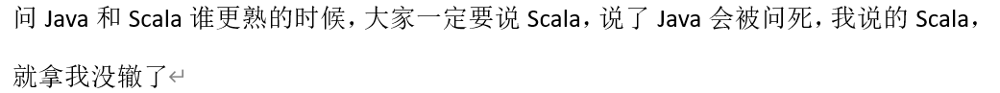
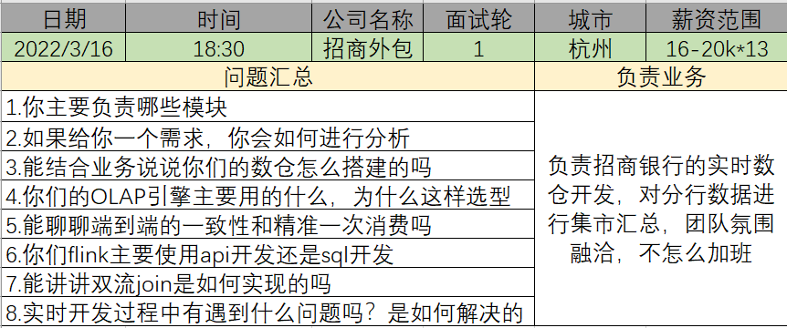
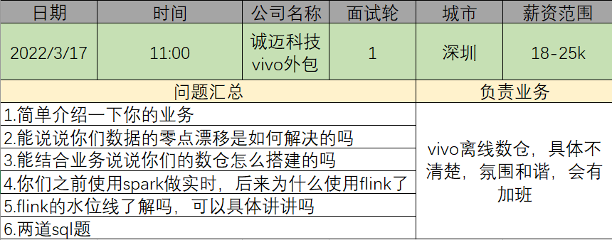
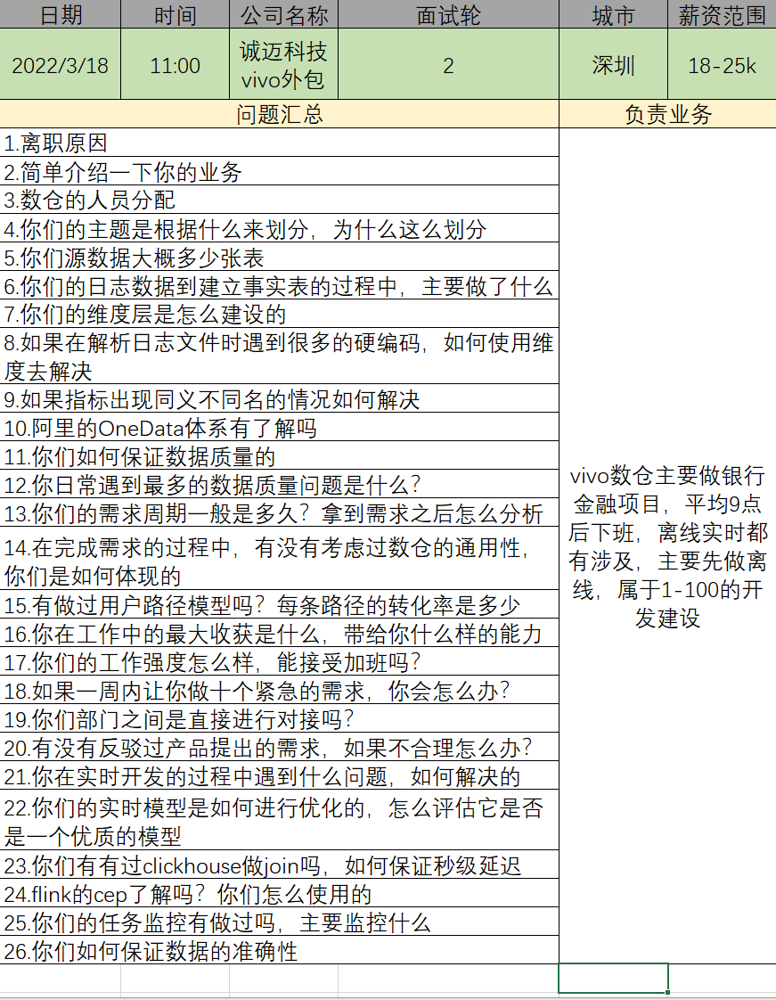
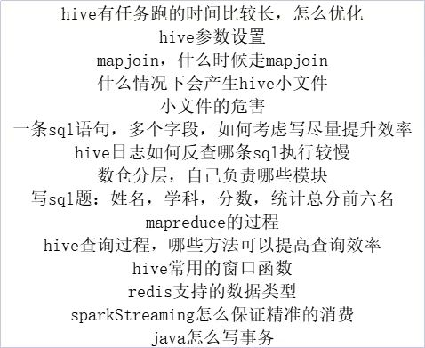
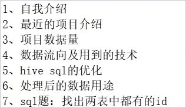
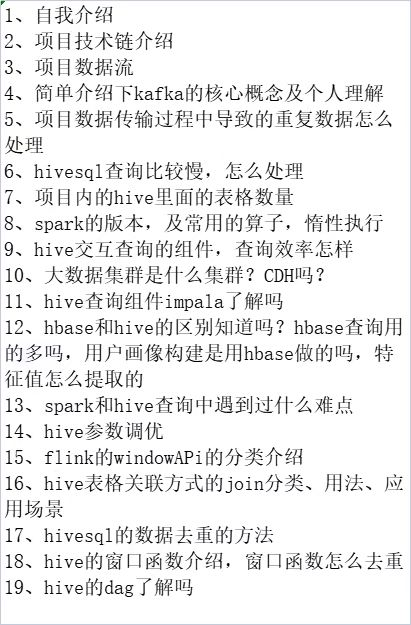
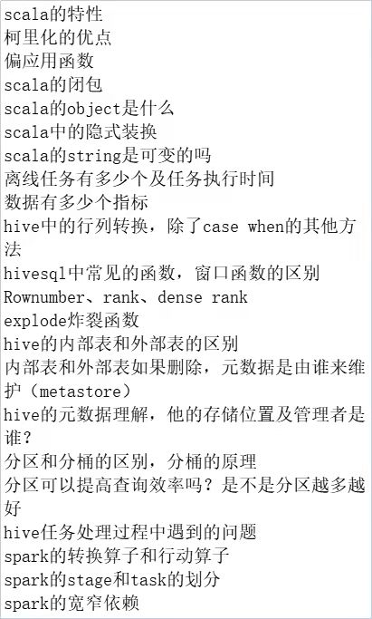
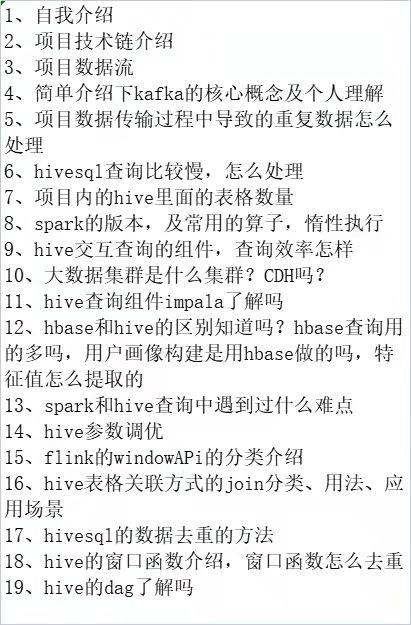

# 大数据面试宝典 🕹️0.1.0  

#### 先说一些废话
小时候我的数学老师经常会告诫我的一句话就是————知其然知其所以然，所以在以往的工作中我就有总结归纳记录的习惯  
最近因为个人原因最近需要换一份工作，所以再详细的编写一下关于Hive面试内容的博客，希望读者喜欢，有什么错误不对的地方欢迎在评论区指出  

## 未处理过的面试题总结记录  
### 大数据面试题
1.数仓增量表全量表
2.项目数据流向
3.项目hbase的rowkey
4.数仓分层
5.断点续传
### 深圳优地网络 
1.sql执行计划；
2.hive优化；
3.sql调优；
4.如何查看内存，cpu占用；
5.多线程，启动个数如何确定，最多多少；
6.java框架；
7.数据清洗；
8.数据倾斜;
### 中软面试流程及问题
自我介绍，包括项目介绍和业务介绍（你在项目中的角色、用到的技术、做的工作）
业务的数据量（每天的数据量有多少）
flume的源头数据
你是如何做数据清洗的
数仓的整体架构
sqoop 的一些参数介绍
hive的窗口函数
建模经验介绍一下
### 大数据面试题
1.业务分析具体讲一讲：什么需求，具体怎么得到
2.数据采集 来源+工具+使用中是否遇到问题
3.数仓搭建
4.埋点数据缺失怎么处理
  埋点数据相关的表示如何设计的
5.SQL执行错误报警机制
6.SQL题
7.项目数据量，日活，漏斗分析
注：要体现自己数据分析挖掘能力
### sql面试题  
1. 输出每天营业额，按时间倒序，然后侧视图排序1.2.3..4 取出小于等于3的数据。
	这个的结果出来后行专列，生成店铺名name，第一天额度day1，第二天额度day2，第三天额度day3 等四列，然后where条件day3>day2>day1  
2. 找出连续三天及三天以上都有营业额，且营业额都在上涨的店铺  
### 上海博彦科技————技术问题
spark：序列化
java的io流分类
spark的算子分类
case class和class的区别
option类型
泛型斜变逆变
函数柯里化
隐式函数
flink-cdc
数仓开发指标编写
mysql存储过程
flink和spark的区别
### 面试题截图汇总

我是 [fx67ll.com](https://fx67ll.com)，如果您发现本文有什么错误，欢迎在评论区讨论指正，感谢您的阅读！  
如果您喜欢这篇文章，欢迎访问我的 [本文github仓库地址](https://github.com/fx67ll/fx67llBigData/blob/main/interview/bigdata/bigdata.md)，为我点一颗Star，Thanks~ :)  
***转发请注明参考文章地址，非常感谢！！！***