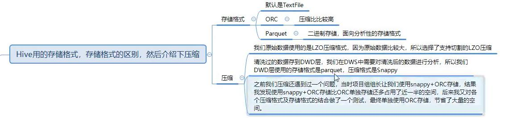
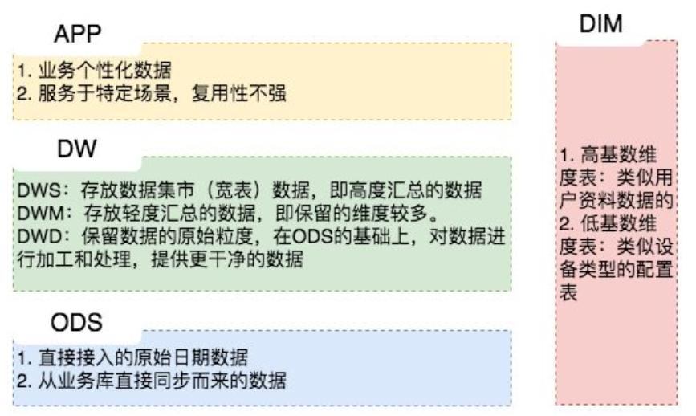
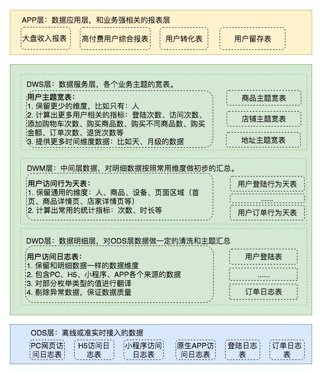
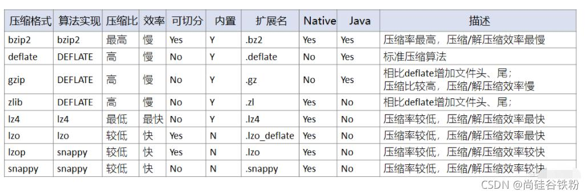
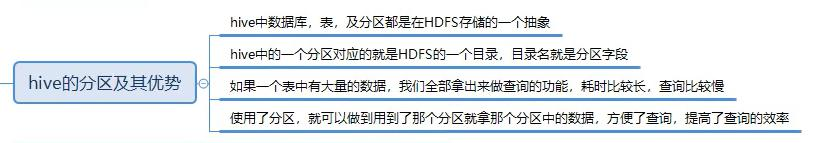

# Hive面试宝典


## Hive的架构


## Hive存储和压缩的相关问题
### 使用的存储格式，存储格式的区别，然后介绍下压缩格式

  
  
  


1. ORCfile存储格式  
	+ 数据按行分块，每块按照列存储，不是真正意义上的列存储，可以理解为分段列存储  
	+ 用于降低Hadoop数据存储空间和加速Hive查询速度  
	+ ORCfile特点是压缩快，快速列存取，是RCfile的改良版本，相比RCfile能够更好的压缩，能够更快的查询，支持各种复杂的数据类型，比如datetime/decimal/struct是以二进制方式存储的  
	+ 需要注意的是ORC在读写时候需要消耗额外的CPU资源来压缩和解压缩，当然这部分的CPU消耗是非常少的  
2. Parquet存储格式  
	+ 能够很好的压缩，有很好的查询性能，支持有限的模式演进，但是写速度通常比较慢  
	+ Parquet文件是以二进制方式存储的，所以是不可以直接读取的，文件中包括该文件的数据和元数据，因此Parquet格式文件是自解析的
3. Snappy压缩格式  
	+ 其中压缩比bzip2 > zlib > gzip > deflate > snappy > lzo > lz4，在不同的测试场景中，会有差异，这仅仅是一个大概的排名情况  
	+ bzip2、zlib、gzip、deflate可以保证最小的压缩，但在运算中过于消耗时间  
	+ 从压缩性能上来看：lz4 > lzo > snappy > deflate > gzip > bzip2，其中lz4、lzo、snappy压缩和解压缩速度快，压缩比低  
	+ 所以一般在生产环境中，经常会采用lz4、lzo、snappy压缩，以保证运算效率  
	
#### 参考文档————使用的存储格式，存储格式的区别，然后介绍下压缩格式
1. [一文搞懂Hive的存储格式与压缩格式](https://blog.csdn.net/zjjcchina/article/details/120986634)  
2. [Hive中的ODS、 DWD、 DWS、 ADS 数仓分层](https://www.cnblogs.com/zyp0519/p/15353930.html)


## Hive分区分桶的相关问题
  
### 动态分区静态分区  


## Hive优化的相关问题  
### 控制Hive中的map数  
1. input的文件总个数，input的文件大小，集群设置的文件块大小  
2. 举例子
	```
	假设input目录下有1个文件a，大小为780M，那么hadoop会将该文件a分隔成7个块（6个128m的块和1个12m的块），从而产生7个map数  
	假设input目录下有3个文件a、b、c，大小分别为10m、20m、130m，那么hadoop会分隔成4个块（10m、20m、128m、2m），从而产生4个map数  
	即，如果文件大于块大小(128m)，那么会拆分，如果小于块大小，则把该文件当成一个块  
	```
3. map是不是越多越好  
	+ 如果一个任务有很多小文件（远远小于块大小128m），则每个小文件也会被当做一个块，用一个map任务来完成  
	+ 而一个map任务启动和初始化的时间远远大于逻辑处理的时间，就会造成很大的资源浪费  
	+ 同时可执行的map数是受限的  
	+ ===============================================================  
	+ 假设`Select count(1) from popt_tbaccountcopy_mes where pt = ‘2012-07-04’;`
	+ 该任务的`inputdir  /group/p_sdo_data/p_sdo_data_etl/pt/popt_tbaccountcopy_mes/pt=2012-07-04`  
	+ 共有194个文件，其中很多是远远小于128m的小文件，总大小9G，正常执行会用194个map任务  
	+ 我通过以下方法来在map执行前合并小文件，减少map数：
	```
	set mapred.max.split.size=100000000;（100M）
	set mapred.min.split.size.per.node=100000000;
	set mapred.min.split.size.per.rack=100000000;
	set hive.input.format=org.apache.hadoop.hive.ql.io.CombineHiveInputFormat;
	前面三个参数确定合并文件块的大小，大于文件块大小128m的，按照128m来分隔，小于128m，大于100m的，按照100m来分隔，
	把那些小于100m的（包括小文件和分隔大文件剩下的），进行合并，最终生成了74个块  
	```
4. 是不是保证每个map处理接近128m的文件块，就高枕无忧了
	+ 比如有一个127m的文件，正常会用一个map去完成，但这个文件只有一个或者两个小字段，却有几千万的记录  
	+ 如果map处理的逻辑比较复杂，用一个map任务去做，肯定也比较耗时
	+ ===============================================================
	+ 当input的文件都很大，任务逻辑复杂，map执行非常慢的时候，可以考虑增加Map数，来使得每个map处理的数据量减少，从而提高任务的执行效率  
	+ 假设`Select data_desc,count(1),count(distinct id),sum(case when …),sum(case when …),sum(…)from a group by data_desc`  
	+ 如果表a只有一个文件，大小为120M，但包含几千万的记录，如果用1个map去完成这个任务，肯定是比较耗时的，这种情况下，我们要考虑将这一个文件合理的拆分成多个  
	+ 这样就可以用多个map任务去完成：
	```
	set mapred.reduce.tasks=10;
	create table a_1 as
	select * from a
	distribute by rand(123);
	这样会将a表的记录，随机的分散到包含10个文件的a_1表中，再用a_1代替上面sql中的a表，则会用10个map任务去完成  
	每个map任务处理大于12M（几百万记录）的数据，效率肯定会好很多
	```
	+ 看上去，貌似这两种有些矛盾，一个是要合并小文件，一个是要把大文件拆成小文件，这点正是重点需要关注的地方  
	+ 根据实际情况，控制map数量需要遵循两个原则：第一是使大数据量利用合适的map数，第二是使单个map任务处理合适的数据量  
	
#### 参考文档————控制Hive中的map数
1. [hive优化之——控制hive任务中的map数和reduce数](http://lxw1234.com/archives/2015/04/15.htm)  


## Hive小文件的相关问题
### 什么情况下会产生小文件?
1. 动态分区插入数据，产生大量的小文件，从而导致map数量剧增  
2. reduce数量越多，小文件也越多(reduce的个数和输出文件是对应的)  
3. 数据源本身就包含大量的小文件  

### 小文件有什么样的危害？
1. 从Hive的角度看，小文件会开很多map，一个map开一个java虚拟机jvm去执行，所以这些任务的初始化，启动，执行会浪费大量的资源，严重影响性能  
2. 在HDFS中，每个小文件对象约占150byte，如果小文件过多会占用大量内存，这样NameNode内存容量严重制约了集群的扩展
	+ 每个hdfs上的文件，会消耗128字节记录其meta信息，所以大量小文件会占用大量内存  

### 如何避免小文件带来的危害？
#### 从小文件产生的途经就可以从源头上控制小文件数量
1. 使用Sequencefile作为表存储格式，不要用textfile，在一定程度上可以减少小文件  
2. 减少reduce的数量(可以使用参数进行控制)  
3. 少用动态分区，用时记得按distribute by分区  

#### 对于已有的小文件
1. 使用hadoop archive命令把小文件进行归档，采用archive命令不会减少文件存储大小，只会压缩NameNode的空间使用  
2. 重建表，建表时减少reduce数量  
	+ 这两个参数是Hive自己确定reduce数量的参数  
	+ 实际开发中，reduce的个数一般通过程序自动推定，而不人为干涉，因为人为控制的话，如果使用不当很容易造成结果不准确，且降低执行效率  
	+ `hive.exec.reducers.bytes.per.reducer`（每个reduce任务处理的数据量，默认为1000^3=1G） 
	+ `hive.exec.reducers.max`（每个任务最大的reduce数，默认为999）  
	+ 在数据进入到reduce中的时候，在map的输入的时候总的数据量小于这个数的时候，会交给一个reduce去处理  
	+ ===============================================================  
	+ 调整reduce数量的方法一
	+ `set hive.exec.reducers.bytes.per.reducer=500000000;`（500M）  
	+ ===============================================================  
	+ 调整reduce数量的方法二  
	+ `set mapred.reduce.tasks = 15;`  
	+ 通过设置reduce的个数进行reduce端的设置，慎用，因为直接定死了  
	+ 虽然设置了reduce的个数看起来好像执行速度变快了，但是实际并不是这样的  
	+ 同map一样，启动和初始化reduce也会消耗时间和资源  
	+ 另外，有多少个reduce，就会有多少个输出文件，如果生成了很多小文件，那这些小文件作为下一次任务的输入，则也会出现小文件过多的问题  
	+ ===============================================================  
	+ 说完上面的内容可以往下继续说，Hive中整个sql的优化可以从下面几个步骤去优化（详见*Hive优化*）
	```
	（1）尽量尽早地过滤数据，减少每个阶段的数据量,对于分区表要加分区，同时只选择需要使用到的字段
	（2）单个SQL所起的JOB个数尽量控制在5个以下
	（3）慎重使用mapjoin,一般行数小于2000行，大小小于1M(扩容后可以适当放大)的表才能使用,小表要注意放在join的左边。否则会引起磁盘和内存的大量消耗
	（4）写SQL要先了解数据本身的特点，如果有join ,group操作的话，要注意是否会有数据倾斜
		set hive.exec.reducers.max=200;
		set mapred.reduce.tasks= 200;---增大Reduce个数
		set hive.groupby.mapaggr.checkinterval=100000 ;--这个是group的键对应的记录条数超过这个值则会进行分拆,值根据具体数据量设置
	（5）如果union all的部分个数大于2，或者每个union部分数据量大，应该拆成多个insert into 语句，这样会提升执行的速度。
	```
3. 通过参数进行调节，设置map/reduce端的相关参数，如下： 
	+ 设置map输入合并小文件的相关参数：  
	```
	//每个Map最大输入大小(这个值决定了合并后文件的数量)
	set mapred.max.split.size=256000000;
	//一个节点上split的至少的大小(这个值决定了多个DataNode上的文件是否需要合并)
	set mapred.min.split.size.per.node=100000000;
	//一个交换机下split的至少的大小(这个值决定了多个交换机上的文件是否需要合并)
	set mapred.min.split.size.per.rack=100000000;
	//执行Map前进行小文件合并
	set hive.input.format=org.apache.hadoop.hive.ql.io.CombineHiveInputFormat;
	```
	+ 设置map输出和reduce输出进行合并的相关参数：  
	```
	//设置map端输出进行合并，默认为true
	set hive.merge.mapfiles = true;
	//设置reduce端输出进行合并，默认为false
	set hive.merge.mapredfiles = true;
	//设置合并文件的大小
	set hive.merge.size.per.task = 256*1000*1000;
	//当输出文件的平均大小小于该值时，启动一个独立的MapReduce任务进行文件merge。
	set hive.merge.smallfiles.avgsize=16000000;
	```

#### 参考文档————Hive小文件的相关问题
1. [Hadoop的Archive归档命令使用指南 ](https://www.cnblogs.com/staryea/p/8603112.html)  
2. [关于hive中的reduce个数的设置](https://www.cnblogs.com/gxgd/p/9431525.html)  
3. [hive优化之——控制hive任务中的map数和reduce数](http://lxw1234.com/archives/2015/04/15.htm)  


## Hive分区分桶


## Hive集成HBase  


## Hive查询的时候on和where的区别


## Hive中 left join 的底层原理


## Hive内部表、外部表、分区表


## Hive和Mysql的区别（真的会有弱智问这种问题？）


## Hive数据倾斜


## Hive自定义函数实现了什么函数什么接口  


## Hive-sql如何查询A表中B表不存在的数据  


## Hive中sortby/orderby/clusterby/distrbuteby


## Hive中split/coalesce/collect list


## null在Hive底层中如何存储


## Hive有哪些保存元数据的方式


## 生产环境中为什么建议使用外部表


我是 [fx67ll.com](https://fx67ll.com)，如果您发现本文有什么错误，欢迎在评论区讨论指正，感谢您的阅读！  
如果您喜欢这篇文章，欢迎访问我的 [本文github仓库地址](https://github.com/fx67ll/fx67llBigData/blob/main/interview/hive/hive.md)，为我点一颗Star，Thanks~ :)  
***转发请注明参考文章地址，非常感谢！！！***