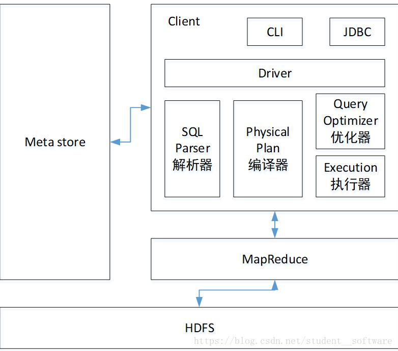

# Hive面试宝典 🕹️v1.0.0

## Hive的介绍
### Hive和Hadoop的关系
1. Hive利用hdfs存储数据，利用MapReduce查询数据  
2. Hive的数据存储在hdfs上，简单的说hive就是hdfs的简单一种映射，比如：hive的一张表映射hdfs上的一个文件，hive的一个数据库就映射为hdfs上的文件夹  
3. Hive是一个计算框架，他是MapReduce的一种封装，实际上他的底层还是MR，Hive就是用人们熟悉的sql对数据进行分析的  
4. Hive执行程序是运行在Yarn上的  

### Hive的特点
1. Hive可以自由的扩展集群的规模，一般情况下不需要重启服务（世界上最大的Hadoop集群在Yahoo!，2009年的规模在4000台节点左右）  
2. Hive支持用户自定义函数，用户可以根据自己的需求来实现自己的函数（可能会引申自定义函数）  
3. 良好的容错性，节点出现问题SQL仍可完成执行（可能会拓展数据倾斜相关问题，或者直接问你你工作中有没有遇到这样的问题）  

### Hive的缺点
1. Hive的HQL表达能力有限。迭代式算法无法表达；数据挖掘方面不擅长  
2. Hive的效率比较低。Hive自动生成的MapReduce作业，通常情况下不够智能化；Hive调优比较困难，粒度较粗  
3. Hive执行延迟
	+ Hive 在查询数据的时候，由于没有索引，需要扫描整个表，因此延迟较高  
	+ 另外一个导致 Hive 执行延迟高的因素是 MapReduce框架，由于MapReduce 本身具有较高的延迟，因此在利用MapReduce 执行Hive查询时，也会有较高的延迟  
	+ 相对的，数据库的执行延迟较低。当然，这个低是有条件的，即数据规模较小，当数据规模大到超过数据库的处理能力的时候，Hive的并行计算显然能体现出优势  


## Hive的架构
  

### Hive的架构说明一
```
Hive的体系结构可以分为以下几部分
（1）用户接口主要有三个：CLI，Client 和 WUI。其中最常用的是CLI，Cli启动的时候，会同时启动一个Hive副本。Client是Hive的客户端，用户连接至Hive Server。在启动 Client模式的时候，需要指出Hive Server所在节点，并且在该节点启动Hive Server。 WUI是通过浏览器访问Hive。
（2）Hive将元数据存储在数据库中，如mysql、derby。Hive中的元数据包括表的名字，表的列和分区及其属性，表的属性（是否为外部表等），表的数据所在目录等。
（3）解释器、编译器、优化器完成HQL查询语句从词法分析、语法分析、编译、优化以及查询计划的生成。生成的查询计划存储在HDFS中，并在随后有MapReduce调用执行。
（4）Hive的数据存储在HDFS中，大部分的查询、计算由MapReduce完成（包含*的查询，比如select * from tbl不会生成MapRedcue任务）。
```

### Hive的架构说明二
```
用户接口：包括 CLI、JDBC/ODBC、WebGUI。
元数据存储：通常是存储在关系数据库如 mysql , derby中。
解释器、编译器、优化器、执行器。
用户接口主要由三个：CLI、JDBC/ODBC和WebGUI。其中，CLI为shell命令行；JDBC/ODBC是Hive的JAVA实现，与传统数据库JDBC类似；WebGUI是通过浏览器访问Hive。
元数据存储：Hive 将元数据存储在数据库中。Hive 中的元数据包括表的名字，表的列和分区及其属性，表的属性（是否为外部表等），表的数据所在目录等。
解释器、编译器、优化器完成 HQL 查询语句从词法分析、语法分析、编译、优化以及查询计划的生成。生成的查询计划存储在 HDFS 中，并在随后有 MapReduce 调用执行。
```

### Hive有哪些保存元数据的方式  
1. 内嵌模式：将元数据保存在本地内嵌的derby数据库中，内嵌的derby数据库每次只能访问一个数据文件，也就意味着它不支持多会话连接  
2. 本地模式：将元数据保存在本地独立的数据库中（一般是mysql），这可以支持多会话连接  
3. 远程模式：把元数据保存在远程独立的mysql数据库中，避免每个客户端都去安装mysql数据库  

#### 参考资料————Hive介绍
1. [Hive简介和架构](https://blog.csdn.net/student__software/article/details/81584448)  
2. [深入学习Hive应用场景及架构原理](https://blog.csdn.net/py_123456/article/details/80292267)  
3. [Hive元数据存储的三种模式，hive有哪些保存元数据的方式，各有什么特点。](https://blog.csdn.net/Ahuuua/article/details/105908562)  
4. [hive安装测试及Hive元数据的三种存储方式](https://www.cnblogs.com/anlang/p/3732682.html)  


## Hive的索引
1. 即从3.0开始索引已经被移除，有一些可替代的方案可能与索引类似：
	+ 具有自动重写的物化视图可以产生非常相似的结果，Hive2.3.0增加了对物化视图视图的支持  
	+ 使用列式文件格式（(Parquet、ORC）–他们可以进行选择性扫描；甚至可以跳过整个文件/块。很显然，例如我们创建表时使用的ORC格式就已经具有了索引的功能  
2. 那hive为什么删除了索引：
	+ 由于Hive是针对海量数据存储的，创建索引需要占用大量的空间，最主要的是hive索引无法自动进行刷新，也就是当新的数据加入时候，无法为这些数据自动加入索引

#### 参考资料————Hive索引
1. [Hadoop Hive概念学习系列之hive里的索引](https://www.cnblogs.com/zlslch/p/6105294.html)  
2. [Hive中索引的使用及注意事项](https://blog.csdn.net/i000zheng/article/details/80435610)  
3. [Hive索引](https://blog.csdn.net/qq_33265875/article/details/113877932)  


## Hive的优化
**Hive优化大全，提取下面这些文章优秀的内容，并专门写一篇文章总结Hive的优化**
1. [hive优化大全-一篇就够了](https://blog.csdn.net/young_0609/article/details/84593316)  
2. [[一起学Hive]之十二-Hive SQL的优化](http://lxw1234.com/archives/2015/06/317.htm)  
3. [Hive/HiveQL常用优化方法全面总结（上篇）](https://www.jianshu.com/p/8e2f2f0d4b6c)  
4. [Hive/HiveQL常用优化方法全面总结（下篇）](https://www.jianshu.com/p/deb4a6f91d3b)  
5. [Hive总结篇及Hive的优化](https://blog.csdn.net/yu0_zhang0/article/details/81776459)  
6. [Hive调优及优化的12种方式](https://zhuanlan.zhihu.com/p/80718835?utm_source=qq)  
7. 上述弄完继续看看社区有没有好的方式，记得后续要自己手动试试  

### 优化大纲之一
1. map join -> hql -> reduce join -> shuffle 会导致消耗磁盘资源，避免reduce阶段，减少shuffle开销  
2. 行列过滤，用哪个列哪哪个列，减少查询开销  
3. 分区分桶扫描优于全表扫描，减少查询开销
4. 设置合理的map数量。map越多jvm开一次关一次开销很大，浪费资源，map少但是存储的条数过多，处理的逻辑很复杂，会导致处理的时间长  
5. 设置合理的reduce数量。涉及到小文件，每一个reduce都会输出一个结果文件，导致小文件越多；reduce越少的话就会降低数据处理的并行度，降低了效率  
6. jvm重用，可以提升效率  
7. 小文件开启map端的局部聚合，CombineFileInputFormat  
8. 压缩，中间结果集压缩（处理要快，用snappy），最终结果集（reduce输出的结果，用bzip2，压缩比大）  

### 优化大纲之二
1. 列裁剪和分区裁剪
2. 谓词下推
3. sort by代替order by
4. group by代替distinct
5. group by配置调整
	+ map端预聚合
	+ 倾斜均衡配置项
6. join基础优化
	+ build table（小表）前置
	+ 多表join时key相同
	+ 利用map join特性
	+ 分桶表map join
	+ 倾斜均衡配置项
7. 优化SQL处理join数据倾斜
	+ 空值或无意义值
	+ 单独处理倾斜key
	+ 不同数据类型
	+ build table过大
8. MapReduce优化
	+ 调整mapper数
	+ 调整reducer数
	+ 合并小文件
	+ 启用压缩
	+ JVM重用
9. 并行执行与本地模式
10. 严格模式
11. 采用合适的存储格式

### 合理的设置Hive中的map数  
1. input的文件总个数，input的文件大小，集群设置的文件块大小  
2. 举例子
	```
	假设input目录下有1个文件a，大小为780M，那么hadoop会将该文件a分隔成7个块（6个128m的块和1个12m的块），从而产生7个map数  
	假设input目录下有3个文件a、b、c，大小分别为10m、20m、130m，那么hadoop会分隔成4个块（10m、20m、128m、2m），从而产生4个map数  
	即，如果文件大于块大小(128m)，那么会拆分，如果小于块大小，则把该文件当成一个块  
	```
3. map是不是越多越好  
	+ 如果一个任务有很多小文件（远远小于块大小128m），则每个小文件也会被当做一个块，用一个map任务来完成  
	+ 而一个map任务启动和初始化的时间远远大于逻辑处理的时间，就会造成很大的资源浪费  
	+ 同时可执行的map数是受限的  
	+ ===============================================================  
	+ 假设`Select count(1) from popt_tbaccountcopy_mes where pt = ‘2012-07-04’;`
	+ 该任务的`inputdir  /group/p_sdo_data/p_sdo_data_etl/pt/popt_tbaccountcopy_mes/pt=2012-07-04`  
	+ 共有194个文件，其中很多是远远小于128m的小文件，总大小9G，正常执行会用194个map任务  
	+ 我通过以下方法来在map执行前合并小文件，减少map数：
	```
	set mapred.max.split.size=100000000;（100M）
	set mapred.min.split.size.per.node=100000000;
	set mapred.min.split.size.per.rack=100000000;
	set hive.input.format=org.apache.hadoop.hive.ql.io.CombineHiveInputFormat;
	前面三个参数确定合并文件块的大小，大于文件块大小128m的，按照128m来分隔，小于128m，大于100m的，按照100m来分隔，
	把那些小于100m的（包括小文件和分隔大文件剩下的），进行合并，最终生成了74个块  
	```
4. 是不是保证每个map处理接近128m的文件块，就高枕无忧了
	+ 比如有一个127m的文件，正常会用一个map去完成，但这个文件只有一个或者两个小字段，却有几千万的记录  
	+ 如果map处理的逻辑比较复杂，用一个map任务去做，肯定也比较耗时
	+ ===============================================================
	+ 当input的文件都很大，任务逻辑复杂，map执行非常慢的时候，可以考虑增加Map数，来使得每个map处理的数据量减少，从而提高任务的执行效率  
	+ 假设`Select data_desc,count(1),count(distinct id),sum(case when …),sum(case when …),sum(…)from a group by data_desc`  
	+ 如果表a只有一个文件，大小为120M，但包含几千万的记录，如果用1个map去完成这个任务，肯定是比较耗时的，这种情况下，我们要考虑将这一个文件合理的拆分成多个  
	+ 这样就可以用多个map任务去完成：
	```
	set mapred.reduce.tasks=10;
	create table a_1 as
	select * from a
	distribute by rand(123);
	这样会将a表的记录，随机的分散到包含10个文件的a_1表中，再用a_1代替上面sql中的a表，则会用10个map任务去完成  
	每个map任务处理大于12M（几百万记录）的数据，效率肯定会好很多
	```
	+ 看上去，貌似这两种有些矛盾，一个是要合并小文件，一个是要把大文件拆成小文件，这点正是重点需要关注的地方  
	+ 根据实际情况，控制map数量需要遵循两个原则：第一是使大数据量利用合适的map数，第二是使单个map任务处理合适的数据量  

### 如何合理的设置Hive中的reduce数  
**待补充**  

### 其他优化方式也待补充
	
#### 参考文档————控制Hive中的map数
1. [hive优化之——控制hive任务中的map数和reduce数](http://lxw1234.com/archives/2015/04/15.htm)  


## Hive的小文件
### 什么情况下会产生小文件?
1. 动态分区插入数据，产生大量的小文件，从而导致map数量剧增  
2. reduce数量越多，小文件也越多(reduce的个数和输出文件是对应的)  
3. 数据源本身就包含大量的小文件  

### 小文件有什么样的危害？
1. 从Hive的角度看，小文件会开很多map，一个map开一个java虚拟机jvm去执行，所以这些任务的初始化，启动，执行会浪费大量的资源，严重影响性能  
2. 在hdfs中，每个小文件对象约占150byte，如果小文件过多会占用大量内存，这样NameNode内存容量严重制约了集群的扩展
	+ 每个hdfs上的文件，会消耗128字节记录其meta信息，所以大量小文件会占用大量内存  

### 如何避免小文件带来的危害？
#### 从小文件产生的途经就可以从源头上控制小文件数量
1. 使用Sequencefile作为表存储格式，不要用textfile，在一定程度上可以减少小文件  
2. 减少reduce的数量(可以使用参数进行控制)  
3. 少用动态分区，用时记得按distribute by分区  

#### 对于已有的小文件
1. 使用hadoop archive命令把小文件进行归档，采用archive命令不会减少文件存储大小，只会压缩NameNode的空间使用  
2. 重建表，建表时减少reduce数量  
	+ 这两个参数是Hive自己确定reduce数量的参数  
	+ 实际开发中，reduce的个数一般通过程序自动推定，而不人为干涉，因为人为控制的话，如果使用不当很容易造成结果不准确，且降低执行效率  
	+ `hive.exec.reducers.bytes.per.reducer`（每个reduce任务处理的数据量，默认为1000^3=1G） 
	+ `hive.exec.reducers.max`（每个任务最大的reduce数，默认为999）  
	+ 在数据进入到reduce中的时候，在map的输入的时候总的数据量小于这个数的时候，会交给一个reduce去处理  
	+ ===============================================================  
	+ 调整reduce数量的方法一
	+ `set hive.exec.reducers.bytes.per.reducer=500000000;`（500M）  
	+ ===============================================================  
	+ 调整reduce数量的方法二  
	+ `set mapred.reduce.tasks = 15;`  
	+ 通过设置reduce的个数进行reduce端的设置，慎用，因为直接定死了  
	+ 虽然设置了reduce的个数看起来好像执行速度变快了，但是实际并不是这样的  
	+ 同map一样，启动和初始化reduce也会消耗时间和资源  
	+ 另外，有多少个reduce，就会有多少个输出文件，如果生成了很多小文件，那这些小文件作为下一次任务的输入，则也会出现小文件过多的问题  
	+ ===============================================================  
	+ 说完上面的内容可以往下继续说，Hive中整个sql的优化可以从下面几个步骤去优化（详见*Hive优化*）
	```
	（1）尽量尽早地过滤数据，减少每个阶段的数据量,对于分区表要加分区，同时只选择需要使用到的字段
	（2）单个SQL所起的JOB个数尽量控制在5个以下
	（3）慎重使用mapjoin,一般行数小于2000行，大小小于1M(扩容后可以适当放大)的表才能使用,小表要注意放在join的左边。否则会引起磁盘和内存的大量消耗
	（4）写SQL要先了解数据本身的特点，如果有join ,group操作的话，要注意是否会有数据倾斜
		set hive.exec.reducers.max=200;
		set mapred.reduce.tasks= 200;---增大Reduce个数
		set hive.groupby.mapaggr.checkinterval=100000 ;--这个是group的键对应的记录条数超过这个值则会进行分拆,值根据具体数据量设置
	（5）如果union all的部分个数大于2，或者每个union部分数据量大，应该拆成多个insert into 语句，这样会提升执行的速度。
	```
3. 通过参数进行调节，设置map/reduce端的相关参数，如下： 
	+ 设置map输入合并小文件的相关参数：  
	```
	//每个Map最大输入大小(这个值决定了合并后文件的数量)
	set mapred.max.split.size=256000000;
	//一个节点上split的至少的大小(这个值决定了多个DataNode上的文件是否需要合并)
	set mapred.min.split.size.per.node=100000000;
	//一个交换机下split的至少的大小(这个值决定了多个交换机上的文件是否需要合并)
	set mapred.min.split.size.per.rack=100000000;
	//执行Map前进行小文件合并
	set hive.input.format=org.apache.hadoop.hive.ql.io.CombineHiveInputFormat;
	```
	+ 设置map输出和reduce输出进行合并的相关参数：  
	```
	//设置map端输出进行合并，默认为true
	set hive.merge.mapfiles = true;
	//设置reduce端输出进行合并，默认为false
	set hive.merge.mapredfiles = true;
	//设置合并文件的大小
	set hive.merge.size.per.task = 256*1000*1000;
	//当输出文件的平均大小小于该值时，启动一个独立的MapReduce任务进行文件merge。
	set hive.merge.smallfiles.avgsize=16000000;
	```

#### 参考文档————Hive小文件的相关问题
1. [Hadoop的Archive归档命令使用指南 ](https://www.cnblogs.com/staryea/p/8603112.html)  
2. [关于hive中的reduce个数的设置](https://www.cnblogs.com/gxgd/p/9431525.html)  
3. [hive优化之——控制hive任务中的map数和reduce数](http://lxw1234.com/archives/2015/04/15.htm)  


## Hive的分区分桶
### Hive分区及其优势
1. Hive中数据库，表，及分区都是在HDFS存储的一个抽象  
2. Hive中的一个分区对应的就是HDFS的一个目录，目录名就是分区字段
3. 如果一个表中有大量的数据，我们全部拿出来做查词的功能，耗时比较长，查询念咬慢  
4. 使用了分区，就可以做到用到了那个分区就拿那个分区中的数据方便了查询．提高了查词的效率  

### Hive分桶及其优势
**待补充**  

**后续处理一下具体内容**  
1. [Hive的分区表和分桶表的区别](https://blog.csdn.net/shudaqi2010/article/details/90288901)  
2. [Hive分区表分桶表的认识与区别 ](https://www.cnblogs.com/xiaoazheng/p/15045728.html)  
3. [深入理解 Hive 分区分桶 （Inceptor）](https://blog.csdn.net/whdxjbw/article/details/82219022)

### 动态分区静态分区  
1. 静态分区与动态分区的主要区别在于静态分区是手动指定，而动态分区是通过数据来进行判断  
2. 详细来说，静态分区的列实在编译时期，通过用户传递来决定的；动态分区只有在SQL执行时才能决定  

#### 参考文档————Hive的分区分桶
1. [Hive静态分区与动态分区的区别](https://blog.csdn.net/u012501054/article/details/102669002)  
2. [Hive的静态分区和动态分区](https://www.cnblogs.com/cssdongl/p/6831884.html)  


## Hive内部表、外部表
### Hive内部表和外部表的区别是什么
**待补充**  

**后续处理一下具体内容**  
1. [Hive内部表和外部表的区别及如何创建](https://blog.csdn.net/qq_39783601/article/details/104934245)  
2. [Hive表（管理表、外部表）的创建规则](https://www.cnblogs.com/leo-wong/articles/14257995.html)  

### 生产环境中为什么建议使用外部表  
1. 因为外部表不会加载数据到Hive，减少数据传输，数据还能共享  
2. Hive不会修改数据，所以无需担心数据的损坏  
3. 删除表时，只删除表结构，不删除数据  


## Hive的存储和压缩
### Hive的数据存储
1. Hive中所有的数据都存储在hdfs中，没有专门的数据存储格式（可支持Text，SequenceFile，ParquetFile，RCFILE等）  
2. 只需要在创建表的时候告诉 Hive数据中的列分隔符和行分隔符，Hive就可以解析数据  
3. Hive中包含以下数据模型：DB、Table、External Table、Partition、Bucket  
	+ DB：在hdfs中表现为`${hive.metastore.warehouse.dir}`目录下一个文件夹  
	+ Table：在hdfs中表现所属db目录下一个文件夹，普通表删除表后，hdfs上的文件都删了  
	+ External Table：外部表, 与table类似，不过其数据存放位置可以在任意指定路径，外部表删除后，hdfs上的文件没有删除，只是把文件删除了  
	+ Partition：在hdfs中表现为table目录下的子目录  
	+ Bucket：桶在hdfs中表现为同一个表目录下根据hash散列之后的多个文件，会根据不同的文件把数据放到不同的文件中  

### 如何存储，使用的文件格式  
  
  
1. 默认是TextFile文件格式  
	+ 文本格式，Hive的默认格式，数据不压缩，磁盘开销大、数据解析开销大  
	+ 对应的Hive API为：`org.apache.hadoop.mapred.TextInputFormat和org.apache.hive.ql.io.HiveIgnoreKeyTextOutputFormat;`
	+ 可结合Gzip、Bzip2使用(系统自动检查，执行查询时自动解压)，但是使用这种方式，hive不会对数据进行切分，从而无法对数据进行并行操作  
2. RCFile文件格式
	+ RCFile是一种行列存储相结合的存储方式，先将数据按行进行分块再按列式存储，保证同一条记录在一个块上，避免读取多个块，有利于数据压缩和快速进行列存储  
	+ 对应Hive API为：`org.apache.hadoop.hive.ql.io.RCFileInputFormat和org.apache.hadoop.hive.ql.io.RCFileOutputFormat;`  
3. ORCFile文件格式
	+ 数据按行分块，每块按照列存储，不是真正意义上的列存储，可以理解为分段列存储  
	+ 用于降低Hadoop数据存储空间和加速Hive查询速度  
	+ ORCfile特点是压缩比比较高，压缩快，快速列存取，是RCfile的改良版本，相比RCfile能够更好的压缩，更快的查询  
	+ 需要注意的是ORC在读写时候需要消耗额外的CPU资源来压缩和解压缩，当然这部分的CPU消耗是非常少的  
	+ 优点：
	```
	每个task只输出单个文件，减少namenode负载；
	支持各种复杂的数据类型，比如：datetime，decima以及复杂类型struct、list、map；
	文件中存储了一些轻量级的索引数据；
	基于数据类型的块模式压缩：integer类型的列用行程长度编码，string类型的列使用字典编码；
	用多个相互独立的recordReaders并行读相同的文件
	无需扫描markers即可分割文件
	绑定读写所需内存
	metadata存储用protocol buffers，支持添加和删除列
	```
4. SequenceFile文件格式
	+ Hadoop提供的二进制文件，Hadoop支持的标准文件  
	+ 数据直接序列化到文件中，SequenceFile文件不能直接查看，可以通过Hadoop fs -text查看
	+ SequenceFile具有使用方便、可分割、可压缩、可进行切片，压缩支持NONE、RECORD、BLOCK（优先）  
	+ 对应Hive API：`org.apache.hadoop.mapred.SequenceFileInputFormat和org.apache.hadoop.hive.ql.io.HiveSequenceFileOutputFormat;`  
5. Parquet文件格式  
	+ 二进制存储，面向分析性的存储格式  
	+ 能够很好的压缩，同时减少大量的表扫描和反序列化的时间，有很好的查询性能，支持有限的模式演进，但是写速度通常比较慢  
	+ Parquet文件是以二进制方式存储的，所以是不可以直接读取的，文件中包括该文件的数据和元数据，因此Parquet格式文件是自解析的  
6. 总结
	+ TextFile 存储空间消耗比较大，并且压缩的text 无法分割和合并 查询的效率最低,可以直接存储，加载数据的速度最高  
	+ SequenceFile 存储空间消耗最大,压缩的文件可以分割和合并 查询效率高，需要通过text文件转化来加载  
	+ ORCFile/RCFile 存储空间最小，查询的效率最高 ，需要通过text文件转化来加载，加载的速度最低  
	+ Parquet 格式是列式存储，有很好的压缩性能和表扫描功能  
	+ SequenceFile/ORCFile/RCFile格式的表不能直接从本地文件导入数据，数据要先导入到TextFile格式的表中，然后再从TextFile表中导入到SequenceFile/ORCFile/RCFile表中  

### 如何压缩，使用的压缩算法
1. 我们原始数据使用的是LZO的压缩格式，因为原始数据比较大，所以选择了支持切割的LZO压缩  
2. 清洗过的数据存到DWD层，我们在DWS中需要对清洗后的数据进行分析，所以我们DWD层使用的存储格式是Parquet，压缩格式是Snappy  
3. 之前我们压缩还遇到过一个问题，当时之前的项目中使用的是Snappy+ORC存储，后来我发现使用Snappy+ORC 存储比ORC单独存储还多占用了近一半的空间  
4. 后来我又对各个压缩格式及存储格式的结合做了一个测试，最终单独使用ORC存储节省了大量的空间  
5. Snappy压缩格式  
	+ 其中压缩比bzip2 > zlib > gzip > deflate > snappy > lzo > lz4，在不同的测试场景中，会有差异，这仅仅是一个大概的排名情况  
	+ bzip2、zlib、gzip、deflate可以保证最小的压缩，但在运算中过于消耗时间  
	+ 从压缩性能上来看：lz4 > lzo > snappy > deflate > gzip > bzip2，其中lz4、lzo、snappy压缩和解压缩速度快，压缩比低  
	+ 所以一般在生产环境中，经常会采用lz4、lzo、snappy压缩，以保证运算效率  

### 数据可分割
1. 在考虑如何压缩那些将由MapReduce处理的数据时，考虑压缩格式是否支持分割是很重要的。  
	考虑存储在HDFS中的未压缩的文件，其大小为1GB，HDFS的块大小为64MB，所以该文件将被存储为16块。  
	将此文件用作输入的MapReduce作业会创建1个输人分片（split，也称为“分块”。对于block，我们统一称为“块”。）  
	每个分片都被作为一个独立map任务的输入单独进行处理  

2. 现在假设，该文件是一个gzip格式的压缩文件，压缩后的大小为1GB。和前面一样，HDFS将此文件存储为16块。
	然而，针对每一块创建一个分块是没有用的，因为不可能从gzip数据流中的任意点开始读取，map任务也不可能独立于其他分块只读取一个分块中的数据。
	gzip格式使用DEFLATE来存储压缩过的数据，DEFLATE将数据作为一系列压缩过的块进行存储。
	问题是，每块的开始没有指定用户在数据流中任意点定位到下一个块的起始位置，而是其自身与数据流同步。
	因此，gzip不支持分割(块)机制。 

3. 在这种情况下，MapReduce不分割gzip格式的文件，因为它知道输入是gzip压缩格式的(通过文件扩展名得知)，而gzip压缩机制不支持分割机制。
	因此一个map任务将处理16个HDFS块，且大都不是map的本地数据。
	与此同时，因为map任务少，所以作业分割的粒度不够细，从而导致运行时间变长。
	
### 压缩模式说明
1. 压缩模式评价：  
	```
	可使用以下三种标准对压缩方式进行评价：
	压缩比：压缩比越高，压缩后文件越小，所以压缩比越高越好。
	压缩时间：越快越好。
	已经压缩的格式文件是否可以再分割：可以分割的格式允许单一文件由多个Mapper程序处理，可以更好的并行化。
	```
2. 压缩模式对比
	```
	BZip2有最高的压缩比但也会带来更高的CPU开销，Gzip较BZip2次之。
	如果基于磁盘利用率和I/O考虑，这两个压缩算法都是比较有吸引力的算法。
	LZO和Snappy算法有更快的解压缩速度，如果更关注压缩、解压速度，它们都是不错的选择。 
	LZO和Snappy在压缩数据上的速度大致相当，但Snappy算法在解压速度上要较LZO更快。
	Hadoop的会将大文件分割成HDFS block(默认64MB)大小的splits分片，每个分片对应一个Mapper程序。
	在这几个压缩算法中 BZip2、LZO、Snappy压缩是可分割的，Gzip则不支持分割。
	```

#### 参考文档————使用的存储格式，存储格式的区别，然后介绍下压缩格式
1. [Hive支持的文件格式和压缩格式及各自特点 ](https://www.cnblogs.com/sx66/p/12039248.html)  
2. [一文搞懂Hive的存储格式与压缩格式](https://blog.csdn.net/zjjcchina/article/details/120986634)  
3. [hive压缩算法对比](https://www.cnblogs.com/gentlemanhai/p/11275442.html)  
4. [Hive中的ODS、 DWD、 DWS、 ADS 数仓分层](https://www.cnblogs.com/zyp0519/p/15353930.html)


## Hive中的连接查询
### Hive左连接和内连接的区别
1. 内连接：连接的键匹配上就连接，没有匹配上就过滤掉  
2. 左连接：以左表为基准，与右表做关联，关联上则连接，右表关联不上的则为null  

### Hive左连接的底层原理  
**参考on和where的理解二**  

**补充文档记得处理一下**  
1. [Hive——join的使用](https://www.cnblogs.com/jnba/p/10673747.html)  
2. [Hive中HSQL中left semi join和INNER JOIN、LEFT JOIN、RIGHT JOIN、FULL JOIN区别](https://blog.csdn.net/helloxiaozhe/article/details/87910386)  


## Hive中的SQL如何转化成MapReduce的
1. `Antlr`定义SQL的语法规则，完成SQL词法，语法解析，将SQL转化为抽象语法树  
2. 遍历抽象语法树抽象出查询的基本组成单元 `QueryBlock`  
3. 遍历`QueryBlock` ，翻译为执行操作树`OperatorTree`  
4. 逻辑层优化器进行`OperatorTree`变换，合并不必要的`ReduceSinkOperator`，减少`shuffle`数据量  
5. 遍厉`OperatorTree`，翻译为`MapReduce`任务  
6. 物理层优化器进行`MapReduce`任务的变换，生成最终的执行计划  


## Hive如何去重
### distinct   
1. 对select 后面所有字段去重，并不能只对一列去重   
2. 当`distinct`应用到多个字段的时候，`distinct`必须放在开头，其应用的范围是其后面的所有字段，而不只是紧挨着它的一个字段，而且`distinct`只能放到所有字段的前面  
3. `distinct`对`NULL`是不进行过滤的，即返回的结果中是包含`NULL`值的  
4. 聚合函数中的`distinct`,如`count()`会过滤掉为`NULL`  

### group by  
1. 对`group by`后面所有字段去重，并不能只对一列去重  

### row_number() over 窗口函数
**待补充**

**后续处理一下具体内容**  
1. [一种巧妙的hive sql数据去重方法](https://blog.csdn.net/shuaiqig/article/details/116228534)  
2. [Hive--数据去重及row_number()](https://blog.csdn.net/ABCDEFG0929/article/details/89190450)  
3. [Hive(十一)--数据去重及row_number()](https://blog.csdn.net/yimingsilence/article/details/70140877)  


## UDF和UDTF
### 如何使用UDF/UDAF/UDTF  
### 为什么使用UDF/UDAF/UDTF   
### 你写过什么样的UDF/UDAF/UDTF  
### Hive自定义函数实现了什么函数什么接口


## 如何监控一个提交后的Hive状态  
1. 使用java代码提交Hive，通过HiveStatement获取日志数据并解析出`application_id`  
2. 就可以通过`application_id`去yarn上查看运行状态  


## Hive查询的时候on和where有什么区别  
### 共同点
1. on先执行，where后执行  
2. 并且where是对连接之后的结果进行的查询条件  

### 第一种理解方式
1. 条件不为主表条件的时候，放在on和where的后面一样  
2. 条件为主表条件的时候，放在on后面，结果为主表全量，放在where后面的时候为主表条件筛选过后的全量  
```
1. select * from a left join b on a.id = b.id and a.dt=20181115;
2. select * from a left join b on a.id = b.id and b.dt=20181115;
3. select * from a join b on a.id = b.id and a.dt=20181115;
4. select * from a left join b on a.id = b.id  where a.dt=20181115;
sql1: 如果是left join 在on上写主表a的条件不会生效，全表扫描。
sql2: 如果是left join 在on上写副表b的条件会生效，但是语义与写到where 条件不同
sql3: 如果是inner join 在on上写主表a、副表b的条件都会生效
sql4: 建议这么写，大家写sql大部分的语义都是先过滤数据然后再join，所以在不了解join on+条件的情况下，条件尽量别写在on后，
直接写到where后就ok了，如果where条件后写b表的过滤条件，就变成了先left join出结果再按照b条件过滤数据  
```

### 第二种理解方式
1. `on`是在生成连接表的起作用的，`where`是生成连接表之后对连接表再进行过滤  
2. 当使用`left join`时，无论`on`的条件是否满足，都会返回左表的所有记录，对于满足的条件的记录，两个表对应的记录会连接起来，对于不满足条件的记录，那右表字段全部是null  
3. 当使用`right join`时，类似，只不过是全部返回右表的所有记录  
4. 当使用`inner join`时，功能与`where`完全相同  
```
经过亲测后，更加深了对on和where的理解，得出以下结论：

0. on后的条件如果有过滤主表的条件，则结果对于不符合该条件的主表数据也会原条数保留，只是不匹配右表数据而已。对于on后面对右表的过滤条件，连接时会用该条件直接过滤右表数据后再和左边进行左连接。总之，对于不满足on后面的所有条件的数据，左表会在结果数据中原条数保留数据，只是不匹配右表数据而已。不满足条件的右表数据各字段会直接以NULL连接主表。
1.ON后对左表的筛选条件对于结果行数会被忽略，但会影响结果中的匹配右表数据，因为只有符合左表条件的数据才会去和符合条件的右表数据进行匹配，不符合条件的左表数据会保留在最后结果中，但匹配的右表数据都是NULL.因此，对于需要过滤左表数据的话，需要把过滤条件放到where后面。
2.ON后的左表条件（单独对左表进行的筛选条件）对于结果行数无影响，还是会返回所有左表的数据，但和右表匹配数据时，系统只会拿左表符合条件（ON后的对左表过滤条件）的数据去和右表符合条件（ON后的对右表过滤条件）的数据进行匹配抓取数据，而不符合条件的左表数据还是会出现在结果列表中，只是对应的右表数据都是NULL。
3.ON后的右表条件（单独对右表进行的筛选条件）会先对右表进行数据筛选后再和左表做连接查询，对结果行数有影响（当左表对右表是一对多时），但不会影响左表的显示行数，然后拿符合条件的右表数据去和符合条件的左表数据进行匹配。
4.Where还是对连接后的数据进行过滤筛选，这个无异议。
5.匹配数据时无论左右表，都是拿符合ON后的过滤条件去做数据匹配，不符合的会保留左表数据，用NULL填充右表数据。

综上得出，ON后面对于左表的过滤条件，在最后结果行数中会被忽略，并不会先去过滤左表数据再连接查询，但是ON后的右表条件会先过滤右表数据再连接左表进行查询。
连接查询时，都是用符合ON后的左右表的过滤条件的数据进行连接查询，只有符合左右表过滤条件的数据才能正确匹配，剩下的左表数据会正常出现在结果集中，但匹配的右表数据是NULL。因此对于左表的过滤条件切记要放到Where后，对于右表的过滤条件要看情况了。如果需要先过滤右表数据就把条件放到ON后面即可。
```

#### 参考文档————Hive查询的时候on和where有什么区别
1. [hive join on 条件 与 where 条件区别](https://www.cnblogs.com/jiangxiaoxian/p/9965978.html)  
2. [SQL中条件放在on后与where后的区别](https://www.cnblogs.com/itjeff/archive/2014/01/17/3524236.html)  


## Hive集成HBase  
1. 将Hbase的客户端`jar`拷贝至`Hive/lib`目录下  
2. 修改`hive/conf`下的`hive-site.xml`配置文件，添加如下属性：  
	```
	<poperty>
		<name>hbase.zookeeper.quorum</name>
		<value>hadoop</value>
	</poperty>
	```
3. 启动Hive，创建表管理表`hbase_table_1`，指定数据存储在Hbase表中，主要是通过`stored by HBaseStorageHandler`类来实现  
4. 往Hive表`hbase_table_1`表中插入数据   

#### 参考文档————Hive集成HBase
1. [如何整合hive和hbase](https://zhuanlan.zhihu.com/p/74041611)  
2. [HiveHbase集成实践](https://www.cnblogs.com/cssdongl/p/6857891.html)  


## Hive和MySQL的区别（真的会有弱智问这种问题？）
1. Hive采用了类SQL的查询语言HQL（hive query language）。除了HQL之外，其余无任何相似的地方。Hive是为了数据仓库设计的  
2. 存储位置：Hive在Hadoop上；MySQL将数据存储在设备或本地系统中  
3. 数据更新：Hive不支持数据的改写和添加，是在加载的时候就已经确定好了；数据库可以CRUD  
4. 索引：Hive无索引，每次扫描所有数据，底层是MR，并行计算，适用于大数据量；MySQL有索引，适合在线查询数据  
6. 执行：Hive底层是MarReduce；MySQL底层是执行引擎  
7. 可扩展性：Hive：大数据量，慢慢扩去吧；MySQL:相对就很少了  

#### 参考文档————Hive和MySQL的区别
1. [Hive与MySQL的区别](https://blog.csdn.net/qq_39597203/article/details/89481867)  


## Hive数据倾斜
### 产生的原因
**待补充**  

### 解决的方案
**待补充**  

**整理一下参考文档**
1. [hive数据倾斜原因和解决方法](https://blog.csdn.net/u010670689/article/details/42920917)  
2. [Hive中的数据倾斜](https://zhuanlan.zhihu.com/p/82616299)  
3. [Hive学习之路 （十九）Hive的数据倾斜 ](https://www.cnblogs.com/qingyunzong/p/8847597.html)  
4. [Hive数据倾斜案例讲解](http://www.techweb.com.cn/cloud/2020-11-03/2809569.shtml)  


## Hive底层如何存储Null值
1. Null在hive底层默认是用'\N'来存储的  
2. 能够经过`alter table test SET SERDEPROPERTIES('serialization.null.format' = 'a');`来修改  

#### 参考文档————Hive底层如何存储Null值
1. [说出null在hive底层如何存储](https://blog.csdn.net/qq_42246689/article/details/84702628)  
2. [hive null的底层存储](https://www.jianshu.com/p/5334a675f014)  
3. [hive面试--hive底层如何存储Null值](https://blog.csdn.net/weixin_44024821/article/details/102418567)  


## Hive表查询技巧
### 查询A表中B表不存在的数据  
**题目：A、B两表，找出ID字段中，存在A表，但是不存在B表的数据。A表总共13w数据，去重后大约3W条数据，B表有2W条数据，且B表的ID字段有索引**  
```
select * from  B
where (select count(1) as num from A where A.ID = B.ID) = 0
```

## Hive中函数的使用方式及区别
### 排序函数————`sort by`/ `order by` / `cluster by` / `distrbute by`  
1. `order by` 会对输入做全局排序，为保证全局的排序，因此只有一个reducer，会导致当输入规模较大时，需要较长的计算时间。
2. `sort by`不是全局排序，其在数据进入reducer前完成排序。因此，如果用`sort by`进行排序，则`sort by`只保证每个reducer的输出有序，不保证全局有序。
3. `distribute by 字段` 根据指定的字段将数据分到不同的reducer，且分发算法是hash散列，常用`sort by`结合使用，Hive要求`distribute by`语句要写在`sort by`语句之前。
4. `cluster by 字段` 除了具有`distribute by`的功能(既可以把数据分到不同的reduce)外，还会对该字段进行排序。但是排序只能是倒序排序，不能指定排序规则为`asc`或者`desc`
5. 因此：
	+ 当数据量规模较大时，不使用 `order by`，使用用 `distribute by + sort by`
	+ 如果 `distribute by` 和 `sort by` 字段是同一个时，此时，`cluster by = distribute by + sort by`

#### 参考文档————Hive中排序函数使用方式及区别
1. [Hive面试题4：讲讲Hive中的排序Sort By、Order By、Cluster By、Distrbute By](https://blog.csdn.net/u012955829/article/details/102847736)  
2. [【hive】orderby,sortby,distributeby,clusterby作用以及用法](http://blog.sina.com.cn/s/blog_7e04e0d00102xq2l.html)  

### 其他待补充说明的函数———— `split` / `coalesce` / `collect list`  


#### 待处理参考文档
1. [处理下实战总结那三个部分](https://www.cnblogs.com/beiyi888/p/9592490.html)  


我是 [fx67ll.com](https://fx67ll.com)，如果您发现本文有什么错误，欢迎在评论区讨论指正，感谢您的阅读！  
如果您喜欢这篇文章，欢迎访问我的 [本文github仓库地址](https://github.com/fx67ll/fx67llBigData/blob/main/interview/hive/hive.md)，为我点一颗Star，Thanks~ :)  
***转发请注明参考文章地址，非常感谢！！！***