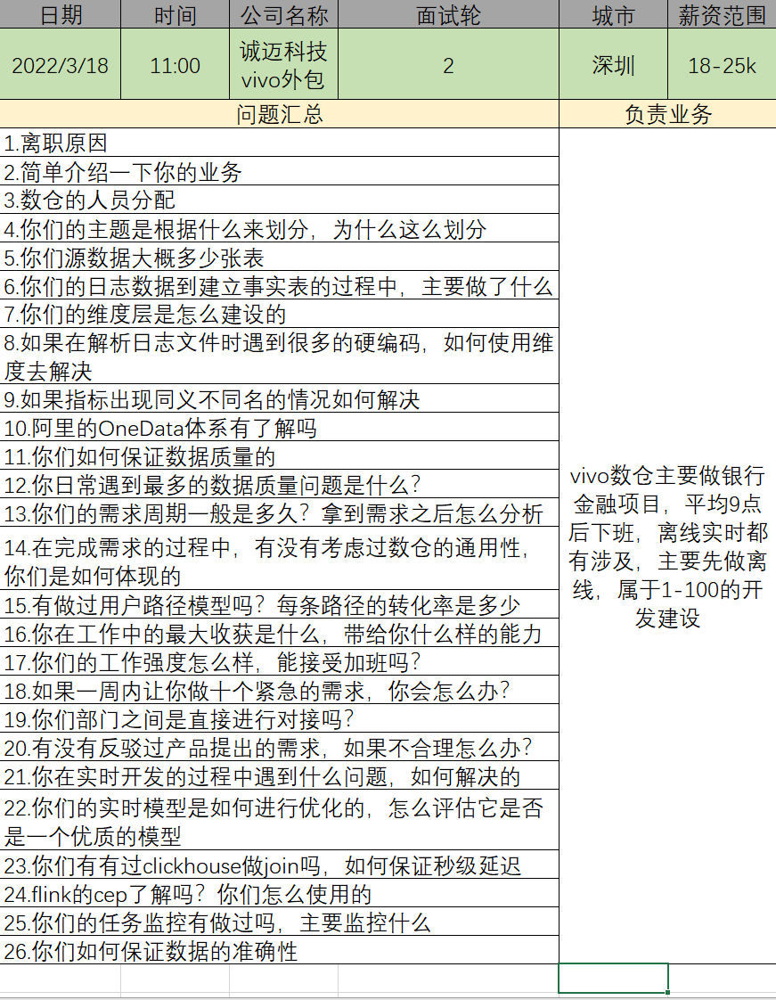
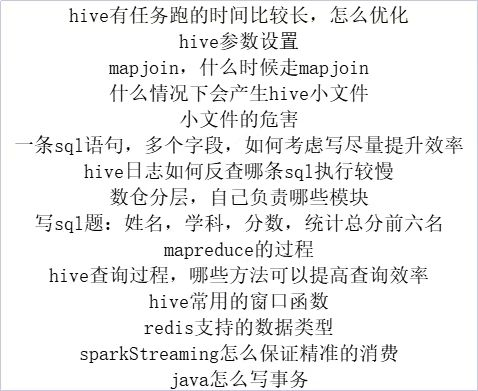

# 大数据面试宝典 🕹️0.1.0  

#### 先说一些废话
小时候我的数学老师经常会告诫我的一句话就是————知其然知其所以然，所以在以往的工作中我就有总结归纳记录的习惯  
最近因为个人原因最近需要换一份工作，所以再详细的编写一下关于Hive面试内容的博客，希望读者喜欢，有什么错误不对的地方欢迎在评论区指出  

## 未处理过的面试题总结记录  
### 大数据面试题
1.数仓增量表全量表
2.项目数据流向
3.项目hbase的rowkey
4.数仓分层
5.断点续传
### 深圳优地网络 
1.sql执行计划；
2.hive优化；
3.sql调优；
4.如何查看内存，cpu占用；
5.多线程，启动个数如何确定，最多多少；
6.java框架；
7.数据清洗；
8.数据倾斜;
### 中软面试流程及问题
自我介绍，包括项目介绍和业务介绍（你在项目中的角色、用到的技术、做的工作）
业务的数据量（每天的数据量有多少）
flume的源头数据
你是如何做数据清洗的
数仓的整体架构
sqoop 的一些参数介绍
hive的窗口函数
建模经验介绍一下
### 大数据面试题
1.业务分析具体讲一讲：什么需求，具体怎么得到
2.数据采集 来源+工具+使用中是否遇到问题
3.数仓搭建
4.埋点数据缺失怎么处理
  埋点数据相关的表示如何设计的
5.SQL执行错误报警机制
6.SQL题
7.项目数据量，日活，漏斗分析
注：要体现自己数据分析挖掘能力
### sql面试题  
1. 输出每天营业额，按时间倒序，然后侧视图排序1.2.3..4 取出小于等于3的数据。
	这个的结果出来后行专列，生成店铺名name，第一天额度day1，第二天额度day2，第三天额度day3 等四列，然后where条件day3>day2>day1  
2. 找出连续三天及三天以上都有营业额，且营业额都在上涨的店铺  
### 上海博彦科技————技术问题
spark：序列化
java的io流分类
spark的算子分类
case class和class的区别
option类型
泛型斜变逆变
函数柯里化
隐式函数
flink-cdc
数仓开发指标编写
mysql存储过程
flink和spark的区别
### 大数据面试题
spark 基础 	excutor 
java scala 基础
Java内部类和外部类：
在Java中，可以将一个类定义在另一个类里面或者一个方法里面，这样的类称为内部类
内部类一般来说包括这四种：成员内部类、局部内部类、匿名内部类和静态内部类
静态成员内部类：使用static修饰类；
非静态成员内部类：未用static修饰类，在没有说明是静态成员内部类时，默认成员内部类指的就是非静态成员内部类；
全局变量、静态全局变量、静态局部变量和局部变量的区别：
变量可以分为：全局变量、静态全局变量、静态局部变量和局部变量。
按存储区域分，全局变量、静态全局变量和静态局部变量都存放在内存的静态存储区域，局部变量存放在内存的栈区。
按作用域分，全局变量在整个工程文件内都有效；静态全局变量只在定义它的文件内有效；静态局部变量只在定义它的函数内有效，并且程序仅分配一次内存，函数返回后，该变量不会消失；局部变量在定义它的函数内有效，但是函数返回后失效。
全局变量(外部变量)的说明之前再冠以static 就构成了静态的全局变量。全局变量本身就是静态存储方式， 静态全局变量当然也是静态存储方式。 这两者在存储方式上并无不同。这两者的区别在于非静态全局变量的作用域是整个源程序，当一个源程序由多个源文件组成时，非静态的全局变量在各个源文件中都是有效的。 而静态全局变量则限制了其作用域， 即只在定义该变量的源文件内有效， 在同一源程序的其它源文件中不能使用它。由于静态全局变量的作用域局限于一个源文件内，只能为该源文件内的函数公用， 因此可以避免在其它源文件中引起错误。
从以上分析可以看出，把局部变量改变为静态变量后是改变了它的存储方式即改变了它的生存期。把全局变量改变为静态变量后是改变了它的作用域，限制了它的使用范围。
static函数与普通函数作用域不同，只在定义该变量的源文件内有效。只在当前源文件中使用的函数应该说明为内部函数(static)，内部函数应该在当前源文件中说明和定义。对于可在当前源文件以外使用的函数，应该在一个头文件中说明，要使用这些函数的源文件要包含这个头文件。
static全局变量与普通的全局变量有什么区别：static全局变量只初使化一次，防止在其他文件单元中被引用;
static局部变量和普通局部变量有什么区别：static局部变量只被初始化一次，下一次依据上一次结果值；
static函数与普通函数有什么区别：static函数与普通函数作用域不同，只在定义该变量的源文件内有效；
全局变量和静态变量如果没有手工初始化，则由编译器初始化为0。局部变量的值不可知。
重写与重载之间的区别：
方法重载：
1、同一个类中
2、方法名相同，参数列表不同（参数顺序、个数、类型）
3、方法返回值、访问修饰符任意
4、与方法的参数名无关
方法重写：
1、有继承关系的子类中
2、方法名相同，参数列表相同（参数顺序、个数、类型），方法返回值相同
3、访问修饰符，访问范围需要大于等于父类的访问范围
4、与方法的参数名无关
java final关键字：
final关键字可以用来修饰类、方法和变量（包括成员变量和局部变量）
final修饰的类不可被继承，即final类没有子类
final修饰的方法不可被子类重写
final修饰的变量=常量，final变量一旦赋值了就无法改变
当方法中的参数被final修饰，该方法只能读取该参数而无法修改该参数
scala 是否可以多继承
Scala 中的多重继承由特质（trait）实现并遵循线性化规则。 在多重继承中，如果一个特质已经显式扩展了一个类，则混入该特质的类必须是之前特质混入的类的子类。 这意味着当混入一个已扩展了别的类的特质时，他们必须拥有相同的父类。
如何查看Spark日志与排查报错问题
[参考文档](https://blog.csdn.net/qq_33588730/article/details/109353336)
如果你运行在YARN模式，你可以在ResourceManager节点的WEB UI页面选择相关的应用程序，在页面点击表格中Tracking UI列的ApplicationMaster，这时候你可以进入到Spark作业监控的WEB UI界面，这个页面就是你Spark应用程序的proxy界面，
[参考文档](https://www.cnblogs.com/gaopeng527/p/4961604.html)
spark 调优
hive 优化
shell脚本 定义函数调用
shell脚本第一行：#!/bin/bash的含义：
第一行的内容指定了shell脚本解释器的路径，而且这个指定路径只能放在文件的第一行。第一行写错或者不写时，系统会有一个默认的解释器进行解释。
linux 脚本授权,Linux授权命令
chmod +x  目录/文件名
Shell标准输出、标准错误 >/dev/null 2>&1
Spark中Task数量的分析：
Job(作业)：Spark根据行动操作触发提交作业，以行动操作将我们的代码切分为多个Job。
Stage(调度阶段)：每个Job中，又会根据宽依赖将Job划分为多个Stage(包括ShuffleMapStage和ResultStage)。
Task(任务)：真正执行计算的部分。Stage相当于TaskSet，每个Stage内部包含了多个Task，将各个Task下发到各个Executor执行计算。
每个Task的处理逻辑完全一样，不同的是对应处理的数据。即：移动计算而不是移动数据。
Partition(分区)：这个是针对RDD而言的，RDD内部维护了分区列表，表示数据在集群中存放的不同位置。[参考文档](https://www.cnblogs.com/upupfeng/p/12385979.html)
spark 数据清洗有哪些及解决问题
spark 提供的序列化类
Hadoop 序列化 反序列化
RDD持久化
spark算子
HDFS容错机制 [参考文档](https://www.cnblogs.com/zhangyinhua/p/7681146.html)
spark应用 执行时划分单位
spark task 数目由什么决定
spark 懒加载
HDFS写数据过程
Hadoop的组成
### 面试题截图汇总

我是 [fx67ll.com](https://fx67ll.com)，如果您发现本文有什么错误，欢迎在评论区讨论指正，感谢您的阅读！  
如果您喜欢这篇文章，欢迎访问我的 [本文github仓库地址](https://github.com/fx67ll/fx67llBigData/blob/main/interview/zero/zero.md)，为我点一颗Star，Thanks~ :)  
***转发请注明参考文章地址，非常感谢！！！***