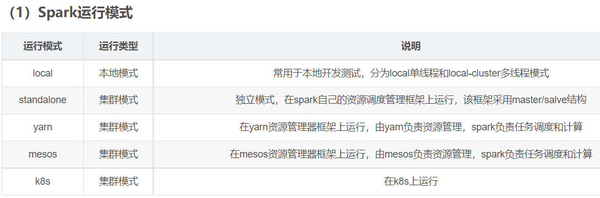
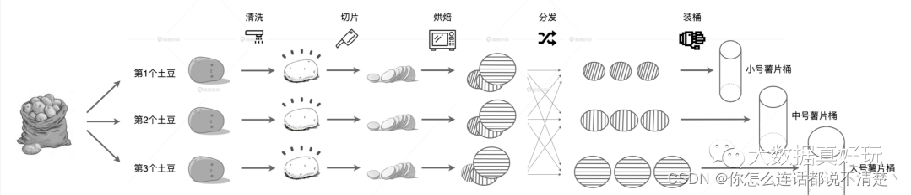

# Spark快速入门 🕹️1.1.0

#### 先说一些废话  
为了方便广大入门菜鸟们准备的一篇关于概念点的简单介绍博客，帮助大家快速上手Spark  


## 常用版本
Spark@3 + Scala@2.12


## 核心模块
1. spark core  
	+ [参考文档————Spark 核心编程](https://blog.csdn.net/weixin_44966780/article/details/122323347)  
2. spark sql  
3. spark streaming  
4. spark mllib(机器学习)  
5. spark graphx(图形挖掘计算)


## 基于Scala的语法
[参考文档————Spark快速上手-WordCount案例](https://blog.csdn.net/weixin_44480968/article/details/119530464)  
wordcount，最简单的上手，主要是做text文件中的单词统计吗，最终版是使用算子  
```
package wc

import org.apache.spark.rdd.RDD
import org.apache.spark.{SparkConf, SparkContext}

object Spark01_WordCount {

  def main(args: Array[String]): Unit = {

    //application
    //Spark框架：是一个环境

    //TODO 建立和spark的连接
    //JDBC:Connection
    val sparkConf = new SparkConf().setMaster("local").setAppName("WordCount")
    val sc = new SparkContext(sparkConf)

    //TODO 执行业务操作
    //1.读取文件，获取一行一行的数据
    var lines: RDD[String] = sc.textFile("datas")

    //2.一行数据进行拆分，形成一个一个的单词(分词):扁平化
    var words: RDD[String] = lines.flatMap(_.split(" "))

    //3.将数据根据分词进行分组，便于统计
    var wordGroup: RDD[(String, Iterable[String])] = words.groupBy(word => word)

    //4.对分组后的数据进行转换（统计）
    val wordToCount = wordGroup.map{
      case (word, list) => {
        (word, list.size)
      }
    }

    //5.将转换结果采集到控制台打印出来
    var varry: Array[(String, Int)] = wordToCount.collect()
    varry.foreach(println)

    //TODO 关闭spark的连接
    sc.stop()
  }
}
```


## 一些概念
### 运行模式（如何连接到spark集群）：本地模式，standalone模式，yarn模式（工作中），k8s容器模式，windows模式  

### 提交应用程序：以及提交时候所用到参数--执行的主类，部署模式，运行类所在的jar包，当前应用的任务参数  
### 配置历史服务：如果spark服务挂了，之前的任务就看不到了，所以需要使用历史服务  
### 配置高可用：解决单点故障，双master，一般都用zookeeper配置，高可用又叫HA  
### Master、Worker -> Excutor、Driver


## 核心概念
### Spark集群角色
1. Cluster Manager，
	集群管理器，它存在于Master进程中，主要用来对应用程序申请的资源进行管理，根据其部署模式的不同，可以分为local，standalone，yarn，mesos等模式。
2. worker，
	worker是spark的工作节点，用于执行任务的提交，主要工作职责有下面四点：
	worker节点通过注册机向cluster manager汇报自身的cpu，内存等信息。
	worker 节点在spark master作用下创建并启用executor，executor是真正的计算单元。
	spark master将任务Task分配给worker节点上的executor并执行运用。
	worker节点同步资源信息和executor状态信息给cluster manager。
3. Executor，
	executor 是真正执行计算任务的组件，它是application运行在worker上的一个进程。
	这个进程负责Task的运行，它能够将数据保存在内存或磁盘存储中，也能够将结果数据返回给Driver。
4. Application，
	application是Spark API 编程的应用程序，它包括实现Driver功能的代码和在程序中各个executor上要执行的代码，一个application由多个job组成。
	其中应用程序的入口为用户所定义的main方法。
5. Driver，
	驱动器节点，它是一个运行Application中main函数并创建SparkContext的进程。application通过Driver 和Cluster Manager及executor进行通讯。
	它可以运行在application节点上，也可以由application提交给Cluster Manager，再由Cluster Manager安排worker进行运行。
	Driver节点也负责提交Job，并将Job转化为Task，在各个Executor进程间协调Task的调度。
6. SparkContext对象，
	sparkContext是整个spark应用程序最关键的一个对象，是Spark所有功能的主要入口点。
	核心作用是初始化spark应用程序所需要的组件，同时还负责向master程序进行注册等。

### RDD
它是Spark中最重要的一个概念，是弹性分布式数据集，是一种容错的、可以被并行操作的元素集合，是Spark对所有数据处理的一种基本抽象。
#### 类比土豆薯片理解RDD  
[参考文档————【Spark Core】【RDD】【01】核心属性 & 执行原理](https://blog.csdn.net/weixin_43589563/article/details/121412814)  
  
```
刚从地里挖出来的土豆食材、清洗过后的干净土豆、生薯片、烤熟的薯片，流水线上这些食材的不同形态，就像是 Spark 中 RDD 对于不同数据集合的抽象。
RDD 具有 4 大属性，分别是 partitions、partitioner、dependencies 和 compute 属性。正因为有了这 4 大属性的存在，让 RDD 具有分布式和容错性这两大最突出的特性。
partitions: 图中每一颗土豆就是 RDD 中的数据分片，3 颗土豆一起对应的就是 RDD 的 partitions 属性。
partitioner: 根据尺寸的不同，即食薯片会被划分到不同的数据分片中。像这种数据分片划分规则，对应的就是 RDD 中的 partitioner 属性。
dependencies: 每种食材形态都依赖于前一种食材，这就像是 RDD 中 dependencies 属性记录的依赖关系
compute: 不同环节的加工方法，对应的刚好就是 RDD 的 compute 属性。
```

#### RDD的特点
1. RDD的数据处理方式类似于IO流，也有装饰者设计模式
2. RDD的数据只有在调用collect方法时，才会真正执行业务逻辑操作
3. RDD是不保存数据的，但是IO可以临时保存一部分数据

#### 代码中是一个抽象类，它代表一个弹性的、不可变、可分区、里面的元素可并行计算的集合。
1. 弹性
	+ 存储的弹性：内存与磁盘的自动切换；
	+ 容错的弹性：数据丢失可以自动恢复；
	+ 计算的弹性：计算出错重试机制；
	+ 分片的弹性：可根据需要重新分片。
2. 分布式：数据存储在大数据集群不同节点上
3. 数据集：RDD 封装了计算逻辑，并不保存数据
4. 数据抽象：RDD 是一个抽象类，需要子类具体实现
5. 不可变：RDD 封装了计算逻辑，是不可以改变的，想要改变，只能产生新的 RDD，在新的 RDD 里面封装计算逻辑
6. 可分区、并行计算，
	默认情况下，Spark 可以将一个作业切分多个任务后，发送给 Executor 节点并行计算，而能够并行计算的任务数量我们称之为并行度。
	这个数量可以在构建 RDD 时指定。记住，这里的并行执行的任务数量，并不是指的切分任务的数量，不要混淆了。

#### 可以通过一系列的算子对rdd进行操作，主要分为Transformation和Action两种操作。
1. Transformation(转换)：是对已有的RDD进行换行生成新的RDD，对于转换过程采用惰性计算机制，不会立即计算出结果。常用的方法有map，filter，flatmap等。
2. Action(执行)：对已有对RDD对数据执行计算产生结果，并将结果返回Driver或者写入到外部存储中。常用到方法有reduce，collect，saveAsTextFile等。

#### RDD核心属性
➢ 分区列表
RDD 数据结构中存在分区列表，用于执行任务时并行计算，是实现分布式计算的重要属性。
➢ 分区计算函数
Spark 在计算时，是使用分区函数对每一个分区进行计算
➢ RDD 之间的依赖关系
RDD 是计算模型的封装，当需求中需要将多个计算模型进行组合时，就需要将多个 RDD 建立依赖关系
➢ 分区器（可选）
当数据为 KV 类型数据时，可以通过设定分区器自定义数据的分区
➢ 首选位置（可选）
计算数据时，可以根据计算节点的状态选择不同的节点位置进行计算

#### 创建RDD
在 Spark 中创建 RDD 的创建方式可以分为四种：
1. 从集合（内存）中创建 RDD，从集合中创建 RDD，Spark 主要提供了两个方法：parallelize 和 makeRDD。
	从底层代码实现来讲，makeRDD 方法其实就是 parallelize 方法  
```
val sparkConf =  new SparkConf().setMaster("local[*]").setAppName("spark")
val sparkContext = new SparkContext(sparkConf)
val rdd1 = sparkContext.parallelize(
 List(1,2,3,4)
)
val rdd2 = sparkContext.makeRDD(
 List(1,2,3,4)
)
rdd1.collect().foreach(println)
rdd2.collect().foreach(println)
sparkContext.stop()
```
2. 从外部存储（文件）创建 RDD，由外部存储系统的数据集创建 RDD 包括：本地的文件系统，所有 Hadoop 支持的数据集，比如 HDFS、HBase 等。
3. 从其他 RDD 创建，主要是通过一个 RDD 运算完后，再产生新的 RDD。详情请参考后续章节。
4. 直接创建 RDD（new），使用 new 的方式直接构造 RDD，一般由 Spark 框架自身使用。

#### RDD算子 Operator，又叫RDD 方法
1. Transformations转换算子：功能的补充和封装，将旧的RDD包装成新的RDD  
	+ *Value类型*
	+ map：将RDD中的数据项，通过map中的函数映射变为一个新的元素（1进1出）  
	+ mapPartition：执行结果与map相同，但是可以一次遍历整个patition  
	+ mapPartitionsWithIndex：类似于mapPartitions，除此之外还会携带分区的索引值  
	+ mapToPair：返回（k，v）格式的RDD  
	+ flatMap：对RDD中的数据项，先map再flat（1进多出）  
	+ flatMapToPair：对RDD中的数据项，先map再flat，在返回（k，v）格式的RDD  
	+ glom  
	+ groupBy  
	+ filter：过滤符合条件的记录数，true的保留、false的过滤  
	+ sample：抽样，传进一个比例值，可以选择传入参数决定是否有放回的抽样  
	+ distinct：去重  
	+ coalesce：常用来减少分区，第二个参数是减少分区的过程中是否产生shuffle，如果用来增加分区，必须设置为true  
	+ repartition：增加或减少分区，会产生shuffle  
	+ sortBy：排序  
	+ *双Value类型*
	+ intersection：交集  
	+ union：合并两个数据集，两个数据集的类型要一致，返回新的RDD的分区数是合并RDD分区数的总和  
	+ subtract：差集  
	+ zip：将两个RDD中的元素（KV格式/非KV格式）变成一个KV格式的RDD，两个RDD的个数必须相同  
	+ zipWithIndex：该函数将RDD中的元素和这个元素在RDD中的索引号（从0开始）组合成KV对  
	+ *Key-Value类型*
	+ partitionBy  
	+ groupByKey：作用在KV格式的RDD上，根据Key进行分组，作用在(K,V)，返回(K,Iterable)  
	+ reduceByKey：将相同的Key根据逻辑进行处理  
	+ reduceByKey  
	+ aggregateByKey  
	+ foldByKey  
	+ combineByKey  
	+ sortByKey：作用在K,V格式的RDD上，对Key进行升序或降序排序  
	+ join：作用在K,V格式的RDD上。根据K进行连接，对（K,V）join(K,W)返回（K,(V,W)）  
	+ leftOuterJoin：作用在K,V格式的RDD上。根据K进行连接，对（K,V）join(K,W)返回（K,(V,W)），左边中的key为主，只显示左边中存在的key值  
	+ rightOuterJoin：作用在K,V格式的RDD上。根据K进行连接，对（K,V）join(K,W)返回（K,(V,W)），右边中的key为主，只显示右边中存在的key值  
	+ fullOuterJoin：作用在K,V格式的RDD上。根据K进行连接，对（K,V）join(K,W)返回（K,(V,W)），两边的key值都显示  
	+ cogroup：当调用类型(K,V)和(K,W)的数据上时，返回一个数据集(K, (Iterable, Iterable))，会产生shuffle  
2. Action行动算子：触发任务的调度和作业的执行  
	+ reduce  
	+ collect：将计算结果回收到Driver端  
	+ count：返回数据集中的元素数，会在结果计算完成后返回到Driver端  
	+ countByKey：作用到KV格式的RDD上，根据Key计数相同Key的数据集元素，返回相同Key的元素对应的条数  
	+ countByValue：作用到KV格式的RDD上，根据数据集每个元素相同的内容来计数，返回相同内容的元素对应的条数  
	+ first：返回数据集中的第一个元素`first=take(1)`  
	+ take：返回一个包含数据集前n个元素的集合`take(n)`  
	+ takeOrdered：返回排序后的前n个元素  
	+ aggregate  
	+ fold，aggregate简化版  
	+ countByKey  
	+ saveAsTextFile  
	+ saveAsObjectFile  
	+ saveAsSequenceFile  
	+ foreach：循环遍历数据集中的元素，运行相应的逻辑  
	+ foreachPartition：遍历的是一个patition上的数据  
[参考这篇文章所列的详细说明记忆](https://blog.csdn.net/weixin_44966780/article/details/122323347)  
*后续再查询一下大全，算子非常重要需要死记硬背，先背常用，面试应该不会全部问*

#### RDD序列化
[参考文档————SparkCore之RDD序列化](https://blog.csdn.net/weixin_42796403/article/details/111874542)  
[参考文档————RDD 序列化](https://blog.csdn.net/To_9426464/article/details/113838897)  
序列化的定义是，将一个对象编码成一个字节流(I/O); 而与之相反的操作被称为反序列化。  
在SparkRDD编程中，初始化工作是在Driver端进行的，而实际运行程序是在Executor端进行的，涉及到了跨进程通信，是需要序列化的。
```
RDD序列化，在类的序列化报错时，即用到类的属性方法等，提供两种思路：
1. 将类序列化，比如混入特质，或变成样例类case
2. 将属性赋值给方法中的一个临时变量，改变生命周期，形成闭包，即将这个属性与类剥离
3. 三个示例代码，注意查看注释

	// 定义类时混入特质
	class User extends Serializable {
	    var age : Int = 30
	}

	// 样例类在编译时，会自动混入序列化特质（实现可序列化接口）
	case class User() {
	    var age : Int = 30
	}
	
	// 类的构造参数其实是类的属性, 构造参数需要进行闭包检测，其实就等同于类进行闭包检测
	class Search(query:String){

		def isMatch(s: String): Boolean = {
			s.contains(this.query)
		}

		// 函数序列化案例
		def getMatch1 (rdd: RDD[String]): RDD[String] = {
			rdd.filter(isMatch)
		}

		// 属性序列化案例
		def getMatch2(rdd: RDD[String]): RDD[String] = {
			/*
			将属性query变成方法的局部变量，与类Search剥离，因为字符串本身是已经实现了Serializable接口，已经是序列化了的
			*/
			val s = query 
			rdd.filter(x => x.contains(s))
		}
	}
```
**Kryo 序列化框架**
```
Spark默认使用Java的序列化器，Java的序列化能够序列化任何的类。但是比较重，序列化后对象的体积也比较大。
Spark出于性能的考虑，Spark2.0开始支持另外一种Kryo序列化机制。Kryo速度是Serializable的10倍。当RDD在Shuffle数据的时候，简单数据类型、数组和字符串类型已经在Spark内部使用Kryo来序列化。
注意：即使使用Kryo序列化，也要继承Serializable接口。
```

#### 闭包检测
[参考文档————Spark中的闭包和闭包检测](https://blog.51cto.com/u_12902538/3727054)  
闭包是一个函数，返回值依赖于声明在函数外部的一个或多个变量。  
闭包通常来讲可以简单的认为是可以访问一个函数里面局部变量的另外一个函数。  
函数在变量不处于其有效作用域时，还能够对变量进行访问，即为闭包；也就是说，变量超出了其作用域，还可以使用，就是闭包现象。  
`闭包 = 代码 + 用到的非局部变量`
**什么是闭包检测？**
```
从计算的角度, 算子以外的代码都是在 Driver 端执行, 算子里面的代码都是在 Executor端执行。
那么在 scala 的函数式编程中，就会导致算子内经常会用到算子外的数据，这样就形成了闭包的效果，
如果使用的算子外的数据无法序列化，就意味着无法传值给 Executor端执行，就会发生错误，
所以需要在执行任务计算前，检测闭包内的对象是否可以进行序列化，这个操作我们称之为闭包检测。
Scala2.12 版本后闭包编译方式发生了改变
```

#### RDD宽窄依赖
1. RDD 血缘关系：
	多个 RDD 之间的依赖关系称为血缘关系。
	RDD 只支持粗粒度转换，即在大量记录上执行的单个操作。将创建 RDD 的一系列 Lineage（血统）记录下来，以便恢复丢失的分区。
	RDD 的 Lineage 会记录 RDD 的元数据信息和转换行为，当该 RDD 的部分分区数据丢失时，它可以根据这些信息来重新运算和恢复丢失的数据分区。  
	RDD 的计算中一旦出错，可以通过血缘关系将数据重新读取进行计算。  
	`.toDebugString` 打印血缘关系  
2. RDD 依赖关系：
	这里所谓的依赖关系，其实就是两个相邻 RDD 之间的关系。*注意* 多个 RDD 之间的依赖关系称为血缘关系。  
	`.dependencies` 打印依赖关系  
3. RDD 窄依赖：
	窄依赖表示每一个父(上游)RDD 的 Partition 最多被子（下游）RDD 的一个 Partition 使用，窄依赖我们形象的比喻为独生子女。
4. RDD 宽依赖：
	宽依赖表示同一个父（上游）RDD 的 Partition 被多个子（下游）RDD 的 Partition 依赖，会引起 Shuffle，总结：宽依赖我们形象的比喻为多生。
5. RDD 阶段划分：
	DAG（Directed Acyclic Graph）有向无环图是由点和线组成的拓扑图形，该图形具有方向，不会闭环。例如，DAG 记录了 RDD 的转换过程和任务的阶段。
	*注意！！！这里可以参考一下源码中的解释*

#### RDD -> DAG
DAG是一个有向无环图，在Spark中， 使用 DAG 来描述我们的计算逻辑。主要分为DAG Scheduler 和Task Scheduler。
1. DAG Scheduler
```
DAG Scheduler 是面向stage的高层级的调度器，DAG Scheduler把DAG拆分为多个Task，每组Task都是一个stage，
解析时是以shuffle为边界进行反向构建的，每当遇见一个shuffle，spark就会产生一个新的stage，
接着以TaskSet的形式提交给底层的调度器（task scheduler），每个stage封装成一个TaskSet。
DAG Scheduler需要记录RDD被存入磁盘物化等动作，同时会需要Task寻找最优等调度逻辑，以及监控因shuffle跨节点输出导致的失败。
```
2. Task Scheduler
```
Task Scheduler 负责每一个具体任务的执行。它的主要职责包括
任务集的调度管理
状态结果跟踪
物理资源调度管理
任务执行
获取结果
```

#### RDD任务划分
RDD 任务切分中间分为：Application、Job、Stage 和 Task
1. Application：初始化一个 SparkContext 即生成一个 Application；
2. Job：一个 Action 算子就会生成一个 Job；
3. Stage：Stage 等于宽依赖(ShuffleDependency)的个数加 1；
4. Task：一个 Stage 阶段中，最后一个 RDD 的分区个数就是 Task 的个数。
**注意：Application->Job->Stage->Task 每一层都是 1 对 n 的关系。**
*源码关键词：`partitionsToCompute ShuffleMapStage ShuffleMapTask ResultStage ResultTask`*  

##### RDD任务划分————Job
job是有多个stage构建的并行的计算任务，job是由spark的action操作来触发的，在spark中一个job包含多个RDD以及作用在RDD的各种操作算子。

##### RDD任务划分————Stage
DAG Scheduler会把DAG切割成多个相互依赖的Stage，划分Stage的一个依据是RDD间的宽窄依赖。
在对Job中的所有操作划分Stage时，一般会按照倒序进行，即从Action开始，遇到窄依赖操作，则划分到同一个执行阶段，遇到宽依赖操作，
则划分一个新的执行阶段，且新的阶段为之前阶段的parent，然后依次类推递归执行。
child Stage需要等待所有的parent Stage执行完之后才可以执行，这时Stage之间根据依赖关系构成了一个大粒度的DAG。
在一个Stage内，所有的操作以串行的Pipeline的方式，由一组Task完成计算。

##### RDD任务划分————TaskSet Task
TaskSet 可以理解为一种任务，对应一个stage，是Task组成的任务集。一个TaskSet中的所有Task没有shuffle依赖可以并行计算。
Task是spark中最独立的计算单元，由Driver Manager发送到executer执行，通常情况一个task处理spark RDD一个partition。
Task分为ShuffleMapTask和ResultTask两种，位于最后一个Stage的Task为ResultTask，其他阶段的属于ShuffleMapTask。

#### RDD持久化
[参考文档————spark持久化操作 persist(),cache()](https://blog.csdn.net/donger__chen/article/details/86366339)  
[参考文档————Spark 持久化（cache和persist的区别）](https://blog.csdn.net/dkl12/article/details/80742498/)  
RDD 中不存储数据，如果一个 RDD 需要重复使用，那么需要重头再来再次执行来获取数据，RDD 对象可以重用，但是数据无法重用，重用对象依旧会重复之前的计算过程  
这样就需要缓存 RDD ，这样数据就可以重复使用  
1. RDD Cache 缓存
```
RDD 通过 Cache 或者 Persist 方法将前面的计算结果缓存，默认情况下会把数据以缓存在 JVM 的堆内存中。
但是并不是这两个方法被调用时立即缓存，而是触发后面的 action 算子时，该 RDD 将会被缓存在计算节点的内存中，并供后面重用。

缓存有可能丢失，或者存储于内存的数据由于内存不足而被删除，RDD 的缓存容错机制保证了即使缓存丢失也能保证计算的正确执行。
通过基于 RDD 的一系列转换，丢失的数据会被重算，由于 RDD 的各个 Partition 是相对独立的，因此只需要计算丢失的部分即可，并不需要重算全部 Partition。

Spark 会自动对一些 Shuffle 操作的中间数据做持久化操作(比如：reduceByKey)。
这样做的目的是为了当一个节点 Shuffle 失败了避免重新计算整个输入。但是，在实际使用的时候，如果想重用数据，仍然建议调用 persist 或 cache。
```
2. RDD CheckPoint 检查点
```
所谓的检查点其实就是通过将 RDD 中间结果写入磁盘

由于血缘依赖过长会造成容错成本过高，这样就不如在中间阶段做检查点容错，如果检查点之后有节点出现问题，可以从检查点开始重做血缘，减少了开销。

对 RDD 进行 checkpoint 操作并不会马上被执行，必须执行 Action 操作才能触发。
```
3. 缓存 和 检查点 的区别
	+ Cache 缓存只是将数据保存起来，不切断血缘依赖。Checkpoint 检查点切断血缘依赖。
	+ Cache 缓存的数据通常存储在磁盘、内存等地方，不安全且可靠性低。Checkpoint 的数据通常存储在 HDFS 等容错、高可用的文件系统，可靠性高。
	+ 建议对 checkpoint()的 RDD 使用 Cache 缓存，这样 checkpoint 的 job 只需从 Cache 缓存中读取数据即可，否则需要再从头计算一次 RDD。
4. cache，persist，checkpoint的区别
	+ cache 将数据*临时*存储在内存中进行数据重用，会添加新的血缘关系依赖，一旦出现问题可以重读数据  
	+ persist 将数据*临时*存储在磁盘文件中进行数据重用，*涉及到磁盘IO，性能较低，但是数据安全，如果作业执行完毕，临时保存的数据文件就会丢失*
	+ checkpoint 将数据*永久*存储在磁盘文件中进行数据重用，*涉及到磁盘IO，性能较低，但是数据安全，一般会独立执行作业，会降低效率*，所以一般和cache组合使用，
		会切断血缘关系，重新建立血缘关系，相当于重新改变数据源  
5. 注意！！！cache()和persist()的使用是有规则的：
```
必须在textfile读取数据或transform等创建一个rdd之后，直接连续调用cache()或者persist()才可以，
如果先创建一个rdd，再单独另起一行执行cache()或者persist()，是没有用的，而且会报错，大量的文件会丢失。
```

#### RDD 分区器
Spark 目前支持 Hash 分区和 Range 分区，和用户自定义分区。Hash 分区为当前的默认分区。
分区器直接决定了 RDD 中分区的个数、RDD 中每条数据经过 Shuffle 后进入哪个分区，进而决定了 Reduce 的个数。
只有 Key-Value 类型的 RDD 才有分区器，非 Key-Value 类型的 RDD 分区的值是 None
每个 RDD 的分区 ID 范围：0 ~ (numPartitions - 1)，决定这个值是属于那个分区的。
1. Hash 分区：对于给定的 key，计算其 hashCode,并除以分区个数取余
2. Range 分区：将一定范围内的数据映射到一个分区中，尽量保证每个分区数据均匀，而且分区间有序
**自定义分区器**
```
class partitionTest(Partitions:Int) extends Partitioner {
	override def numPartitions: Int = Partitions
	override def getPartition(key: Any):Int = {
		val a = if (key.toString.indexOf("hbase") != -1) {
			1
		}else if (key.toString.indexOf("spark") != -1){
			2
		}else{
			0
		}
	}
}
```

#### RDD 文件读取与保存
Spark 的数据读取及数据保存可以从两个维度来作区分：文件格式以及文件系统。
文件格式分为：text 文件、csv 文件、sequence 文件以及 Object 文件；
文件系统分为：本地文件系统、HDFS、HBASE 以及数据库。
➢ text 文件
➢ sequence 文件
SequenceFile 文件是 Hadoop 用来存储二进制形式的 key-value 对而设计的一种平面文件(Flat File)。在 SparkContext 中，可以调用 sequenceFile[keyClass, valueClass](path)。
➢ object 对象文件
对象文件是将对象序列化后保存的文件，采用 Java 的序列化机制。可以通过 objectFile[T: ClassTag](path)函数接收一个路径，读取对象文件，返回对应的 RDD，也可以通过调用saveAsObjectFile()实现对对象文件的输出。因为是序列化所以要指定类型。

### 数据结构————累加器(Acc)
#### 累加器定义
分布式共享只写变量（Executor端的task不能互相访问累加器的值），累加器用来把 Executor 端变量信息聚合到 Driver 端。

#### 累加器原理
Driver 程序中定义的变量，在 Executor 端的每个 Task 都会得到这个变量的一份新的副本，每个 Task 更新这些副本的值后，传回 Driver 端进行 Merge。

#### 获取累加器的值
1. 少加：转换算子中调用累加器，如果没有行动算子，那么不会执行  
2. 多加：转换算子中调用累加器，如果没有行动算子，那么不会执行  
3. 所以一般放置在行动算子中  

#### 累加器示例代码
*系统自带部分累加器：longAccumulator , doubleAccumulator , coolectionAccumulator*
```
Object Spark06_Accumulator {
  def main(args: Array[String]): Unit = {
    val conf: SparkConf = new SparkConf().setAppName(this.getClass.getName).setMaster("local[*]")
    val sc = new SparkContext(conf)
    val rdd: RDD[(String, Int)] = sc.makeRDD(List(("a", 1), ("b", 2), ("a", 3), ("b", 4)))
    // 声明累加器
    val sumAcc: LongAccumulator = sc.longAccumulator("sumAcc")
    rdd.foreach {
      case (word, count) => {
        // 使用累加器
        sumAcc.add(count)
      }
    }
    // 累加器的toString方法
    //println(sumAcc)
    //取出累加器中的值
    println(sumAcc.value)
    sc.stop()
  }
}

```
#### 自定义累加器示例代码
```
object Spark07_MyAccumulator {
  def main(args: Array[String]): Unit = {
    val conf: SparkConf = new SparkConf().setAppName(this.getClass.getName).setMaster("local[*]")
    val sc = new SparkContext(conf)
    val rdd: RDD[String] = sc.makeRDD(List("Hello", "HaHa", "spark", "scala", "Hi", "Hello", "Hi"))
    // 创建累加器
    val myAcc = new MyAccumulator
    //注册累加器
    sc.register(myAcc, "MyAcc")
    rdd.foreach{
      datas => {
        // 使用累加器
        myAcc.add(datas)
      }
    }
    // 获取累加器的结果
    println(myAcc.value)

    sc.stop()
  }
}

// 自定义累加器
// 泛型分别为输入类型和输出类型
class MyAccumulator extends AccumulatorV2[String, mutable.Map[String, Int]] {
  // 定义输出数据变量
  var map: mutable.Map[String, Int] = mutable.Map[String, Int]()

  // 累加器是否为初始状态
  override def isZero: Boolean = map.isEmpty

  // 复制累加器
  override def copy(): AccumulatorV2[String, mutable.Map[String, Int]] = {
    val MyAcc = new MyAccumulator
    // 将此累加器中的数据赋值给新创建的累加器
    MyAcc.map = this.map
    MyAcc
  }

  // 重置累加器
  override def reset(): Unit = {
    map.clear()
  }

  // 累加器添加元素
  override def add(v: String): Unit = {
    if (v.startsWith("H")) {
      // 判断map集合中是否已经存在此元素
      map(v) = map.getOrElse(v, 0) + 1
    }
  }

  // 合并累加器中的元素
  override def merge(other: AccumulatorV2[String, mutable.Map[String, Int]]): Unit = {
    val map1: mutable.Map[String, Int] = this.map
    val map2: mutable.Map[String, Int] = other.value
    // 合并两个map
    map = map1.foldLeft(map2) {
      (m, kv) => {
        m(kv._1) = m.getOrElse(kv._1, 0) + kv._2
        m
      }
    }
  }

  // 获取累加器中的值
  override def value: mutable.Map[String, Int] = {
    map
  }
}

```


### 数据结构————广播变量
#### 广播变量定义
1. 广播变量是一个只读变量

2. 通过它我们可以将一些共享数据集或者大变量缓存在Spark集群中的各个机器上而不用每个task都需要copy一个副本，
	后续计算可以重复使用，减少了数据传输时网络带宽的使用，提高效率。相比于Hadoop的分布式缓存，广播的内容可以跨作业共享。

3. 广播变量要求广播的数据不可变、不能太大但也不能太小(一般几十M以上)、可被序列化和反序列化、并且必须在driver端声明广播变量，
	适用于广播多个stage公用的数据，存储级别目前是MEMORY_AND_DISK。

4. 广播变量存储目前基于Spark实现的BlockManager分布式存储系统，Spark中的shuffle数据、加载HDFS数据时切分过来的block块都存储在BlockManager中，
	不是今天的讨论点，这里先不做详述了。

#### 广播变量作用
广播变量用来高效分发较大的对象。向所有工作节点发送一个较大的只读值，以供一个或多个Spark操作使用。
比如，如果你的应用需要向所有节点发送一个较大的只读查询表，广播变量用起来都很顺手。在多个并行操作中使用同一个变量，但是 Spark会为每个任务分别发送

#### 广播变量使用步骤
1. 调用SparkContext.broadcast（广播变量）创建出一个广播对象，任何可序列化的类型都可以这么实现。  
2. 通过广播变量.value，访问该对象的值。  
3. 变量只会被发到各个节点一次，作为只读值处理（修改这个值不会影响到别的节点）。  

#### 广播变量使用场景
join会导致数据量几何增长，并且会影响shuffle的性能，不推荐使用

#### 为什么会出现广播变量
闭包数据，是以Task为单位发送的，每个任务中包含闭包数据这样可能会导致，一个Executor中包含大量重复数据，并且占用大量内存
Executor其实就是一个JVM，所以在启动时，会自动分配内存
完全可以将任务中的闭包数据放置在Executor的内存中，达到共享的目的  
Spark中的广播变量就可以将闭包的数据保存到Executor的内存中  
Spark中的广播变量不能更改  


## Spark作业运行流程
spark应用程序以进程集合为单位在分布式集群上运行，通过driver程序的main方法创建sparkContext的对象与集群进行交互。具体运行流程如下
1. sparkContext向cluster Manager申请CPU，内存等计算资源。
2. cluster Manager分配应用程序执行所需要的资源，在worker节点创建executor。
3. sparkContext将程序代码和task任务发送到executor上进行执行，代码可以是编译成的jar包或者python文件等。接着sparkContext会收集结果到Driver端。


## Spark RDD迭代过程
1. sparkContext创建RDD对象，计算RDD间的依赖关系，并组成一个DAG有向无环图。
2. DAGScheduler将DAG划分为多个stage，并将stage对应的TaskSet提交到集群的管理中心，stage的划分依据是RDD中的宽窄依赖，
	spark遇见宽依赖就会划分为一个stage，每个stage中包含来一个或多个task任务，避免多个stage之间消息传递产生的系统开销。
3. taskScheduler 通过集群管理中心为每一个task申请资源并将task提交到worker的节点上进行执行。
4. worker上的executor执行具体的任务。


## Spark核心编程
RDD：弹性分布式数据集
累加器：分布式共享只写变量
广播变量：分布式共享只读变量


## Spark RDD 算子使用的场景
### 统计每一个省份每个广告被点击数量排行的Top3  
[参考文档————spark统计每个省份广告点击量top3](https://www.cnblogs.com/dd110343/p/14319556.html)  
`时间戳，省份，城市，用户，广告`  中间字段使用间隔线分隔，示例`xxxxx - 河北 - 北京 - 张三 - A`
#### 思路
1. 获取原始数据：时间戳、省份、城市、用户、广告编号  
2. 将原始数据转换为（（省份，广告），1）的形式  
3. 将转换后的数据进行聚合（（省份，广告），1）=>（（省份，广告），sum）  
4. 将聚合后的数据进行结构的转换：（（省份，广告），sum）=>（省份，（广告，sum））  
5. 将得到的数据按照省份来进行分组，转换为（省份，（广告，sum），（广告，sum），（广告，sum）... ）的格式  
6. 将分组后的数据组内排序（降序），取前三名  
#### 代码
```
package rdd.operator.transform

import org.apache.spark.rdd.RDD
import org.apache.spark.{SparkConf, SparkContext}

object SparkTest {

  def main(args: Array[String]): Unit = {
    val sparkConf: SparkConf = new SparkConf().setMaster("local[*]").setAppName("Operator")
    val sc = new SparkContext(sparkConf)

    // 1.获取原始数据：时间戳、省份、城市、用户、广告编号
    val dataRDD: RDD[String] = sc.textFile("datas/agent.log")

    // 2.将原始数据转换为（（省份，广告），1）的形式
    val mapRDD: RDD[((String, String), Int)] = dataRDD.map(
      (line: String) => {
        val datas: Array[String] = line.split(" ")
        ((datas(1), datas(4)), 1)
      }
    )

    // 3.将转换后的数据进行聚合（（省份，广告），1）=>（（省份，广告），sum）
    val reduceRDD: RDD[((String, String), Int)] = mapRDD.reduceByKey(_ + _)

    // 4.将聚合后的数据进行结构的转换：（（省份，广告），sum）=>（省份，（广告，sum））
    val newmapRDD: RDD[(String, (String, Int))] = reduceRDD.map({
      case ((prv, ad), sum) => (prv, (ad, sum))
    })

    // 5.将得到的数据按照省份来进行分组
    val groupRDD: RDD[(String, Iterable[(String, Int)])] = newmapRDD.groupByKey()

    // 6.将分组后的数据组内排序（降序），取前三名
    val resultRDD: RDD[(String, List[(String, Int)])] = groupRDD.map(
      str => {
        val list: List[(String, Int)] = str._2.toList.sortBy(_._2)(Ordering.Int.reverse).take(3)
        val sheng=str._1
        println("省份编号："+sheng+"|广告编号："+list.head._1+"  点击量："+list.head._2+
          "|广告编号："+list(1)._1+"  点击量："+list(1)._2+
          "|广告编号："+list(2)._1+"  点击量："+list(2)._2)
        (str._1, list)
      }
    )

    /*val resultRDD: RDD[(String, List[(String, Int)])] = groupRDD.mapValues(
      (iter: Iterable[(String, Int)]) => {
        iter.toList.sortBy(_._2)(Ordering.Int.reverse).take(3)
      }
    )*/

    // 7.打印结果
    println("每个省份对应广告点击量前三名：")
    resultRDD.collect()

    sc.stop()
  }
}
```

## Spark案例实操
### 日志类文件操作
1. 日志文件的操作基本都是`WordCount`  
2. 统计排名类的需求，可以使用算子，也可以使用自定义累加器（Accumulator）  
3. 优化方向就是避免`Shuffle`  
	+ 有些运算需要将各节点上的同一类数据汇集到某一节点进行计算，把这些分布在不同节点的数据按照一定的规则汇集到一起的过程称为`Shuffle`  
	+ `Shuffle`是一个涉及到`CPU（序列化反序列化）`、`网络 I/O（跨节点数据传输）`以及`磁盘I/O（Shuffle中间结果落地）`的操作  
	+ [Spark Shuffle 详解](https://zhuanlan.zhihu.com/p/67061627)  
#### 触发Shuffle的操作
1. repartition相关：repartition、coalesce  
2. *ByKey操作：groupByKey、reduceByKey、combineByKey、aggregateByKey等  
3. join相关：cogroup、join  

### 日志文件信息
日期、用户ID、SessionID、页面ID、动作时间、动作内容（搜索关键字，点击品类ID，点击产品ID，下单品类ID，下单产品ID，支付品类ID，支付产品ID）  
1. 数据文件每行数据用下划线分割  
2. 每行数据表示用户的一次行为，这个行为只能是搜索、点击、下单、支付，这四种行为当中的一种  
3. 如果搜索关键词为null，表示数据不是搜索数据  
4. 如果点击品类ID和点击产品ID为-1，表示数据不是点击数据  
5. 针对下单行为，一次可以下单多次商品，所以品类ID和产品ID可以是多个，ID之间用逗号隔开，如果本次不是下单行为，数据用null表示  
6. 支付与下单相同  
#### 需求
1. 热门品类Top10（简易排名：点击数多 -> 下单数多 -> 支付数多）  
2. Top10热门品类中每个品类的Top10活跃Session统计  
3. 页面单跳转换率统计，主要是为了知晓从首页最终跳转到支付页面的用户数量（首页(500w) -> 产品列表(400w) -> 页面详情(300w) -> 订单页面(100w) -> 支付页面(10w)）
	+ 什么是页面单跳转换率，比如一个用户在一次 Session 过程中访问的页面路径 3,5,7,9,10,21，那么页面 3 跳到页面 5 叫一次单跳，7-9 也叫一次单跳，
	+ 那么单跳转化率就是要统计页面点击的概率，比如：计算 3-5 的单跳转化率，先获取符合条件的 Session 对于页面 3 的访问次数（PV）为 A，
	+ 然后获取符合条件的 Session 中访问了页面 3 又紧接着访问了页面 5 的次数为 B，那么 B/A 就是 3-5 的页面单跳转化率
##### 页面单跳转换率统计思路
1. 根据Session分组统计用户行为  
2. 根据时间戳信息排序用户的行为（sessionid,timestamp,首页 -> sessionid,timestamp,产品列表 -> sessionid,timestamp,页面详情 -> sessionid,timestamp,订单页面 -> sessionid,timestamp,支付页面）  
3. 去掉每条信息的无用内容，只保留行为信息（首页 -> 产品列表 -> 页面详情 -> 订单页面 -> 支付页面）  
4. 分别统计各个行为的总数（首页行为总数 / 产品列表行为总数 / 页面详情行为总数 / 订单页面行为总数 / 支付页面行为总数）  
5. 分子(产品列表行为总数) / 分母(首页行为总数)，其他类比即可  

### 工程化
1. web应用中是 `MVC（model - view -controller）`  
2. 大数据领域没有view，所以它的三层架构是
	+ controller，控制层，调度  
	+ service，服务层，服务  
	+ dao，持久层，操作数据库或者读取文件  
3. 目录：application、bean、common、controller、dao、service、util  
#### Java中的工具类ThreadLocal，避免SparkContext在controller和service中传递，增加耦合  
```
object EnvUtil {
	private val scLocal = new ThreadLocal[SprakContext]();
	def put( sc : SparkContext ): Unit = {
		scLocal.set(sc);
	}
	def take(): SparkContext = {
		scLocal.get();
	}
	def clear(): Unit = {
		scLocal.remove();
	}
}
```

## Spark SQL
### Spark SQL 特点
封装RDD -> DataFrame、DataSet
可以使用相同的方式连接不同的数据源 -> Hbase、Hive、MySQL、文件  
兼容Hive
使用JDBC和ODBC  


我是 [fx67ll.com](https://fx67ll.com)，如果您发现本文有什么错误，欢迎在评论区讨论指正，感谢您的阅读！  
如果您喜欢这篇文章，欢迎访问我的 [本文github仓库地址](https://github.com/fx67ll/fx67llBigData/blob/main/note/spark/spark-quickstart.md)，为我点一颗Star，Thanks~ :)  
***转发请注明参考文章地址，非常感谢！！！***